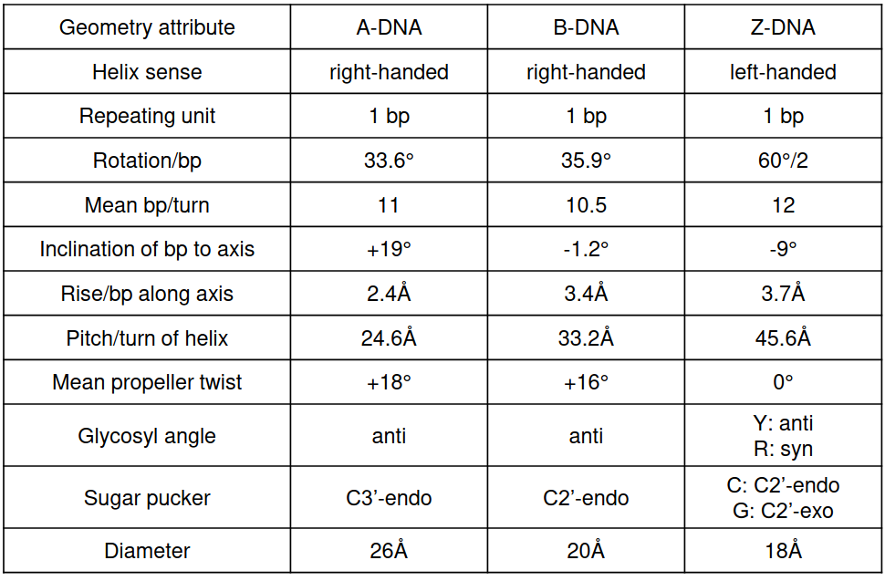

# 11 Principles of nucleic acid structure
## DNA
### Introduction

Double stranded helices
Different levels of condensation:
- Helix formation
- Wrapping around histones

Two views for higher order compactation:
- **Solenoid** forms 30nm fiber, and loops with scaffold proteins forming chromatin fiber
- **TADs**: Topologically associating domains, which correspond to regions where the DNA contact inside the region happens more often.


### DNA structure
Packing depends on phase of cell, DNA is less compacted during interphase, because DNA has to be less condensed in order to be transcribed.

DNA can have 3 different double helix structures, depending on the characteristics of the sequence and the chemical conditions of the medium.


#### B-DNA

- Standard and most frequent DNA conformation.
- Major groove:
  - 22A width
  - High base accesibility
- Minor groove
  - 12 A
- Possible binding sites

#### A-DNA

- Formed more frequently in dehydrated samples.
- More compact than B-DNA.
- Bases are not oriented orthogonally
- Similar to RNA double helices

#### Z-DNA

- Found usually in sequences where purines and pirimidines altern eachother (e.g. GCGCGCGCGC)
- Left handed
- Assumed functions:
  - Role in transmision regulation
  - Supercoiling
- Binding site for DNA modifying



#### DNA G-Quadruplex

- Tetra based units with chelated cation (e.g. K) at center
- Several G tetrads (usually TTAGGG-repeats) build the G-Quadruplex
- Functions
    - Involved in telomerase activity
    - Down- or up-regulation in promoter regions
    - Translation control in 5' UTRs of RNA

## RNA

### Introduction

RNA was thought to be of relative small importance in biology. After the sequencing of the human genome, it was found that only 1% of DNA sequence was translated into proteins, but 80-90% was transcribed into RNA. This suggested a more important role, and the years after, **ribozymes**, miRNA and other important functions of RNA were discovered.


### MicroRNAs
- Hairpin structure
- Processing into 21-mers
- Direct proteins to **target mRNAs** by sequence complementarity
- Cleavage/repression of translation of target protein

### CRISPR/Cas9 system

RNA act as a guide for cutting DNA at certain positions

### ATP

Is involved in most signaling pathways and constitutes the molecular currency of cells.

### Aptamers

- Oligonucleotide of small size (<70 bp)
- Bind to specific target molecules
- Aptamers is usually used for molecules artificially selected from databases. When they occur in nature and are involved in regulation are often called **riboswitches**.

### Riboswitches

- RNA transcripts capable of regulating their own gene expression
- Usually involved in recognizing small molecules (metal ions, aminoacids...)
- Contain both the structural information and sequence. $\to$ RNA world.

### RNA structure


#### Primary structure

The order of bases/nucleotides (AUGC)

#### Secondary structural elements

Watson pairs are **isosteric**: Replacement of A-U by C-G doesn't disrupt the structure (1).

Stabilization occurs mainly through **base stacking**: The exclusion of water produced by the planar contact of bases at a constant distance, leads to a lower free energy than when considering those base pairs on their own.

The secondary structure of DNA corresponds to the number of pairs and their positions in the sequence. Because of (1) these positions are more important than their exact pairs, and RNAs tend to conserve their structure more than their sequence.

Different representations:


Two of those pairs $n_1 = (a, b), n_2 = (c, d)$ in a given sequence can form three patterns:
- **disjoint**: (a b)(c d)
- **nested**: (a(c d)b)
- **crosses**: (a (b)c d)
Crosses are considered as part of the tertiary structure, and are also called **pseudoknots**, and are usually problematic for the algorithms predicting secondary structure.

Secondary structure motifs:
- **Hairpin loop**: Has a duplex terminator with at least 3 bp.
- Internal loop:
- **Multiloop**: Three or more stacks come together.
- **Bulge**
- **Unpaired regions**:
  - Dangling ends at 5' or 3' regions
  - Linkers
- More exotic ones (i.e. **kissing hairpin**)


#### Secondary structure prediction

Three main algorithms:
- **Nussinov** $\to$ Maximize number of base pairs
- **Zuker, McCaskill**... $\to$ Thermodynamic energy minimisation
- **RNAalifod** $\to$ Covariance analysis

##### Nussinov
Align RNA sequence to itself.
Scoring: Individual scores are independent of overall structure: 1 if is a base pair, 0 otherwise.
3 phases:
- Initialization
- Fill (calculate scores)
- Traceback

``` python
def Nussinov(RNAseq):
    N[i, i] = 0,        for 1 <= i < n  #diagonal
    N[i, i - 1] = 0     for 2 <= i < n  #subdiagonal
    while Table is not filled:
        fill N[i, j]
    traceback() #shortest path from the largest to the smallest value

```
\[ N(i, j) = max
  \begin{cases}
    N[i + 1, j - 1] + \delta(S_i, S_j)\\
    N[i+1, j]\\
    N[i, j-1]\\
    max_{i<j<k}N[i, k] + N[k+1, j]
  \end{cases}
\]


Advantage: DP is easy to implement
Drawbacks:
- No stacking interactions considered
- Lots of bulges and many internal loops
- cannot discern between optimal tracebacks

##### Thermodynamic energy minimization

As in protein predictions, derived from the assumption that the thermodynamically most stable structure is most likely the actual structure.

Hence, these algorithms search for structure with minimal $\Delta G$ instead of searching for maximal number of pairs.

Nearest neighbor energy model:
- Data derived from calorimetric experiments.
- $\Delta G$ for small loops and stacks verified experimentally. Multiloops have estimated values and longer loops are extrapolated.
- Free energy of the structure can be approximated by the sum over the free energy of the structural elements.

**Zuker algorithm**: Uses another table to capture base stacking (similar to some approaches for dealing with differential gap penalty costs)

Problem: There are several local optima (ensembles), and the global optima often doesn't correspond to the biologically found structure. For solving these ensemble probabilities are calculated.

**McCaskill algorithm**: Dynamic programming approach that tries to enumerate all substructures and calculate probabilities for structures and set of structures.

##### Covariation analysis

Based on covariation of base pairs to mantain structures along evolution. Has a high accuracy. Given MSA derives consensus structure, and then performs energy minimization/creates a HMM model to find an structure coherent with the alignment.

There are several flavours with different approaches:
- SCFG (HMM)
- RNAalifold (Free energy)


#### Tertiary structure

3D arrangement of DNA:  helical duplexes, triple-stranded structures...
Highly determined by:
- Some secondary structural elements like kissing hairpins or pseoduknots.
- Sequence-specific contacts.

Has some characteristic pseudotorsion angles ($\theta, \eta$), as happens with protein Ramachandran plots.


Base-pairing parameters:


##### Base pair identification

Determining if two bases are a base pair is very important for tertiary structure prediction.

Several algorithms exists for this purpose.

Due to different hydrogen bond formation, RNA has also some base pairings that are not typical **Watson & Crick** (green) pairings, defined by the Sugar plane (base inespecific, purple) or the **Hoogsten plane**(blue). These pairings can be clustered into (12) families, where the isostericity among pairs and edge contacts is a determining factor for the tertiary structure of the molecule.


**Isostericity**: Similar distances found between the C1 carbon in a base pair for a given tautomeric conformation. (e.g. 10.5A for cis watson pairings), that leads to a potential pair replacement without significantly disturbing the backbone trace.

[https://www.sciencedirect.com/science/article/pii/S0014579314004931]()

##### RNA 3D structure prediction (algorithms)

## Websites

- NDB (equivalent to PDB).
- Rfam database
- Other (slides)
- diprodb
