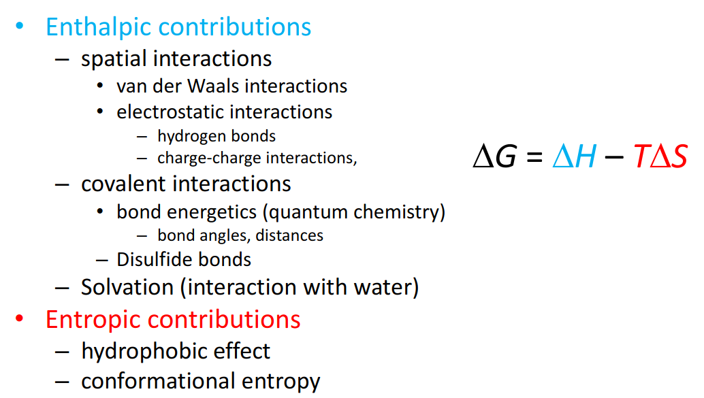
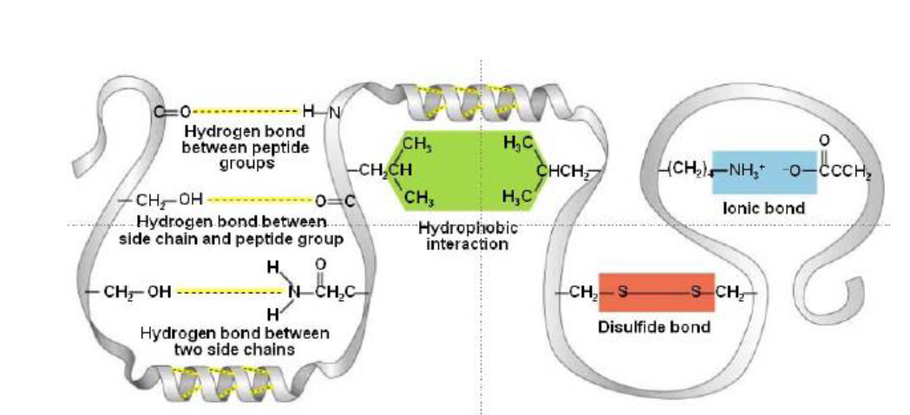
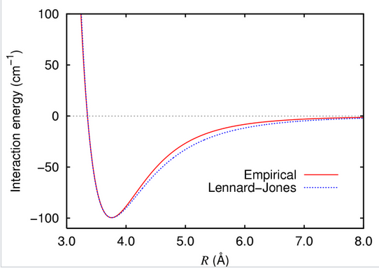
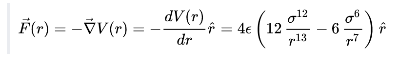
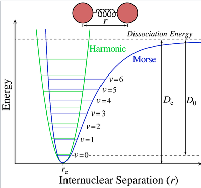
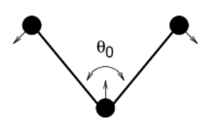
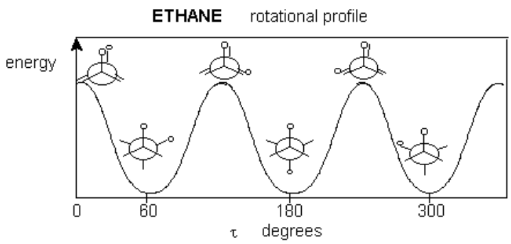
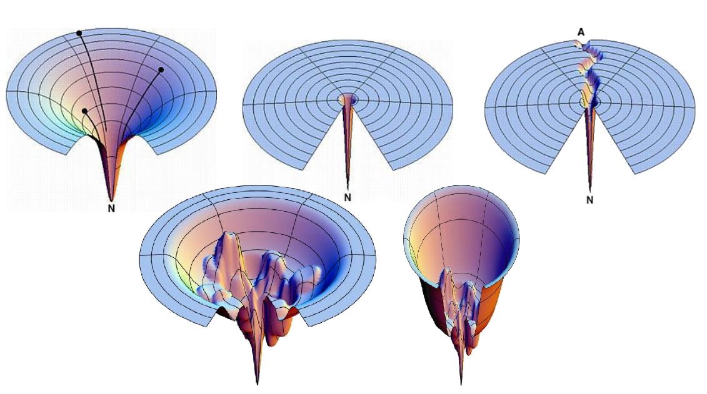
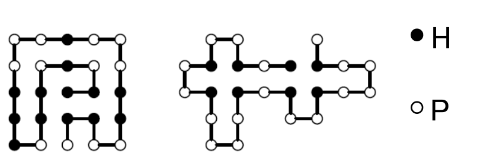

# 4 The protein folding problem
## Introduction
In the 50s, Anfinsen experiments:
- Used Mercaptoethanol to reduce disulfide bridges
- Urea to denaturalize due to low PH
- Observed how the protein folded back to its native conformation.
- added notes (If the renaturalization of the protein was too fast, it could fold to a wrong structure. Furthermore, other proteins need chaperones to fold properly)

## Anfinsen's dogma: The thermodynamic hypothesis

Proteins adopt structures that corresponds to their global minimum of free energy:

$\Delta G = \Delta H - T \Delta S$

Protein folding problem can be restated as finding the structure corresponding to the global minimum of free energy. Different several characteristics of the folding affect the energy state of the system, and these can be represented mathematically using different expressions, where usually there exists a tradeoff between accuracy modeling the physical term and complexity of the mathematical expression. In the following, some options for modeling those will be presented.

[https://manual.gromacs.org/documentation/current/reference-manual/functions/bonded-interactions.html]()

## Energetics of protein folding

### Non-covalent interactions
#### van der Waals interactions

Correspond to:

- Permanent dipole-permanent dipole forces
- Permanent dipole-induced dipole forces
- instantaneous induced dipole-induced dipole(London dispersion forces).

##### Lennard-jones Potential:

$V(r) = 4 \epsilon \left[\left(\frac{\sigma}{r}\right)^{12} - \left(\frac{\sigma}{r}\right)^{6}\right]$

- The first term with power 12 represents the repulsion between the particles
- The second term with power 6 represents the attraction.
- $\epsilon$ represents the depth of the dwell
- $\sigma$ represents the r with V = 0
- r is the distance between two particles
- Notice that $\frac{\sigma}{r}$ < 1 if the particles are further than $\sigma$, and in this case the attraction term is bigger, and the function tends to 0 from below as r grows.
- and $\frac{\sigma}{r}$ > 1 if the particles are further than $\sigma$, and in this case the repulsion term is bigger, so V tends to infinity as r goes to 0 (highly unfavorable energetics)
- Both terms have even exponents, so the function has a global minimum.

The force can be derived from the gradient of the formula:

#### Ionic (electrostatic) interactions

Attraction between particles of opposite net charge(positive or negative), and repulsion between particles of the same symbol. In general these forces are depending additively of the net charge, and are strongly influenced by the characteristics of the solvant. It can represent the interaction between ions, and between ions and dipoles.

Usually modeled using Coulomb's law, which in vectorial form is:

$E_{vacuum}(i, j) = \frac {q_1 q_2}{4 \pi \epsilon _0 r_{ij}^2}$

where:

- $\epsilon _0$ is the electric constant in vacuum
- $q_i, q_j$ are the net charge of the two particles
- $r_{ij}$ is the distance between the particles

and for other media we have:

$E_{medium}(i, j) = \frac {1}{D_{medium}} \cdot E_{vacuum}$

Where $D_{medium}$ represents the dielectric constant of medium (80 for water, 2-3 for protein interior)

Also can be used for modeling dipole-dipole interactions, where the dipole moments have to be considered.

### Covalent interactions

Derived from the distances, angle... of the covalent bonds.

#### Covalent bond distance

Can be described using Morse-potential or approximated using harmonic potential.

##### Morse potential

$E_{morse} = D(1 - e^{-B(r-r_0)})^2$

where:
- $D :=$  the well depth
- $B :=$ the width of the well
- $r_0 :=$ equilibrium bond distance
- $r :=$ actual bond distance

##### Harmonic (quadratic) potential

$E_H = k_{ij} (r_{ij} - r_0)^2$

where:
- $k_{ij} :=$ bond specific shape of the function
- $r_0 :=$ equilibrium bond distance
- $r :=$ actual bond distance

#### Covalent bond angles

##### Single bonds
**Single Bond angle vibration** is represented by an harmonic potential too, but is less stiff than the bond distance.

$V_{a}(\theta_{ijk}) = k_{ijk}^\theta (\theta_{ijk} - \theta_0)^2$

##### Dihedral angles
**Dihedral angles** present a periodic behaviour energy-wise.

The different conformations of side chains due to rotatable bonds are called rotamers.

Torsion energies of the dihedral angle are described by the angles and their multiplicities, and are the source of conformational flexibility for the same protein structure.

A possible form for modeling this:

$E_{tors} = k(1 + cos(n \tau - \tau_0))$

- $\tau :=$ Dihedral angle
- $n :=$ Multiplicity
- $k :=$ constant depending on the atom types defining the dihedral angle

##### Disulfide bonds

Frequently formed in smaller proteins where are needed for the stabilization, because non-covalent forces are too small

### Solvation energy

The interaction of a protein with the solvant has a big impact on the energetics of the system. Solvation involves bond formation, hydrogen bonding and Van der Waals forces.

Solvation energy is the term used for describing the energetic change of the system due to this interactions, which wouldn't occur in vacuum.

Every atom has a specific solvation energy per surface, which can be computed, but it's expensive. Considering all pairwise interactions between the protein and the water molecules in in practice not done, due to the large number of degreees of freedom needed to model water.

A simplified model assumes that solvation energy is proportional to the surface area buried after folding.

**Born energy** is the term used for describing the change in free energy of transferring an ion from a medium of low dielectric constant (i.e the interior of the protein) to one of high dielectric constant (i.e the surface in contact with water).

### Hydrophobic effect

The hydrophobic effect is the observed tendency of nonpolar substances to aggregate in an aqueous solution and exclude water molecules, and constitutes the strongest driving force for protein folding.

Water forms ordered arrangements (cages) around hydrophobic solutes, with low entropy. If hydrophobic sidechains are packed together, the entropy of the solvent is higher, which is energetically favorable.

## Entropy. The folding funnel

Under statistic mechanics, entropy is proportional to the number of possible microscopic configurations (microstates), which could give rise to the observed macroscopic state (macrostate) of the system.

Boltzmann entropy equation:

$S = k_b ln(W)$

where:
- $k_b :=$ Boltzmann constant
- $W :=$ the number of microstates

Clasical thermodynamics:

$\Delta S = \frac {\Delta Q_{rev}}{T}$

Applied to proteins:
- In unfolded state, many conformations for bond angles, sidechains... are possible, the entropy is high.
- In folded state, only one (or a few) microstates are possible, hence the entropy is low.

In order to be able to fold, proteins have to compensate this loss of entropy by enthalpic contributions.

Furthermore, how do proteins find the lowest energy state?

### Models for protein folding

The **Levinthal paradox** states that the number of possible conformations that can be reach by a protein with a certain sequence is so high, that if proteins would "try out" all of them until they found the right one, it would need more time than the current age of the universe to find its correct fold.

In conclussion: Protein folding is not a random or exhaustive search, it occurs along a gradient towards the global minimum, as visualized in the **folding funnel**.

Some properties of this model:
- Different initial conformations lead to the same global minimum
- Local minima can act as kinectic traps, that also can correspond to alternative foldings.

#### Two-state folding model

- Only considers two states (folded and unfolded)
- recquires cooperavity
- likely true for small proteins

### Step-wise folding model

- 1. Formation of structural elements
- Condensation of preformed elements into 3D structure

### Lattice proteins folding model

- Highly simplified model for protein folding.
- It considers the folding as a path on a 2D or 3D grid.
- Polar and hydrophobic residues are considered separately
- Estimates the energetics in function of adjacency in the lattice.
