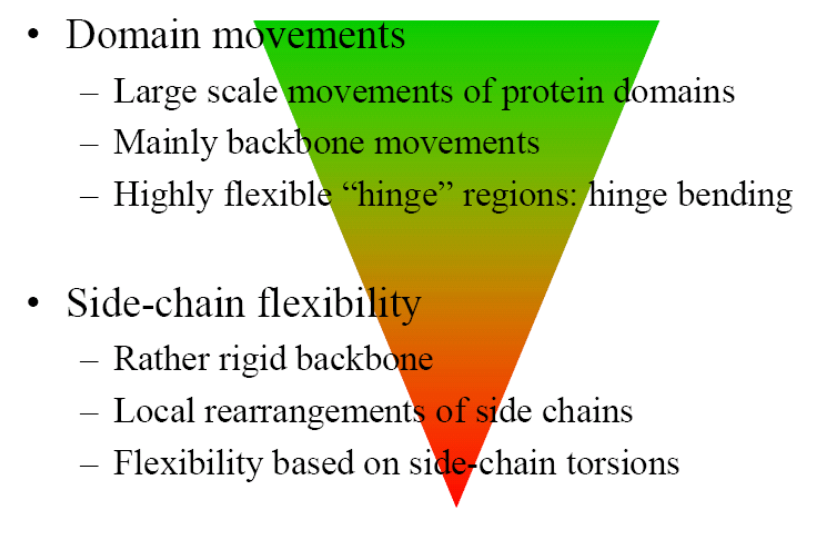
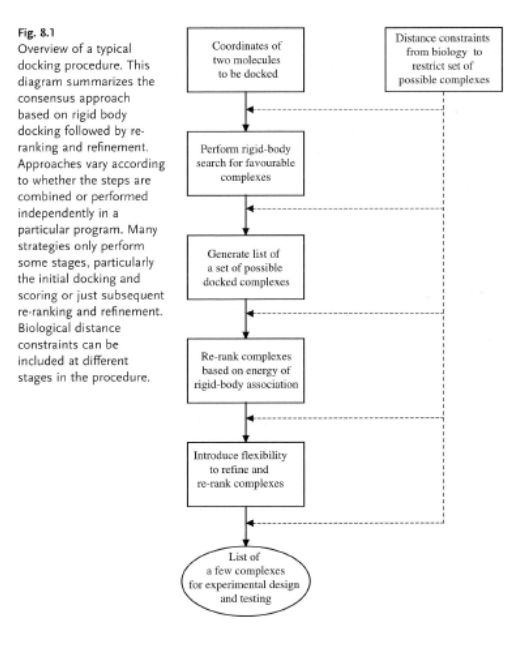
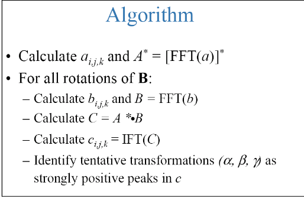

##7.1 Protein interactions
### Introduction
Protein function is determined by their interaction with other proteins:

- Transcription factors with DNA.
- Enzyme-substrate
- Complex formations.

Proteins interact with other proteins mostly through large hydrophobic flat areas
(interfaces),
where some charged residues define the orientation of the interaction.
These interactions usually involve intermediary water molecules for creating hydrogen bonds.
The contribution to the energy of the interaction is not uniform: few residues correspond
to the main part of the energy.

Protein flexibility:

Although their limits are sometimes blurred, there are three main in-silico approaches for finding protein-protein interactions:
- Based on observed 3D structures
- Based on sequence information (*ab initio*).
- Based on evolutionary relationships.

### Structure-based methods

Mostly assume protein are rigid bodies and a key-lock model.
Overview of the general algorithm:

Models use 6 degrees of freedom (X, Y, Z-rotation, translation).
Modifying those parameters they try to find the rigid transformation bringing B in contact with A.
They take into account both spatial and chemical interactions.

#### Rigid body search

Proteins are discretized, transformed into a 3d matrix, where each cell can have different values:
- Larger protein's position is fixed, the bins corresponding to the core of the molecule have a negative value (penalization score), the surface has a value of one and the outside a value of 0.
- Smaller protein can have only two values: 1 in the interior of the molecule and 0 on the outside.
- Then the shape complementarity is calculated as the convolution of a on b:

  $C_{\alpha, \beta, \gamma} = \sum_{l}\sum_{m}\sum_{n} a_{l, m, n} \cdot b_{l+\alpha, m+\beta, n+\gamma}$

The objective is to maximize this function, where for each bin contributes: +1 if there's an overlap between smaller protein and surface of bigger protein. p (for example -15) if the smaller protein overlaps with interior of bigger protein. 0 otherwise.

Exhaustive search is $O(N^6)$, $O(N^3logN^3)$ if Fourier Fast transform is used.

#### Global search

- Through exhaustive search of Montecarlo sampling.
- Scoring based on energy terms such as force-fields.

#### Semi-flexible Docking

Assumes the backbone is rigid and side chains are flexible.

Algorithm rearranges side chains and calculates energy.

#### Brownian Dynamics simulation

- Simulates physical encounter of molecules in solution.
- Is highly expensive computationally.
- Based on Langevin equation, which describes the evolution of the position of one molecule.

#### Docking of IDP

- Intrinsically disordered proteins interactions are based mostly explained by large differences in net charge between proteins, and is a phenomenon gaining importance during the recent years.

### *Ab initio* docking

Classical docking problem for finding interactions in a database where we only have information about the sequence of the proteins.
Force fields using for predicting the conformations.

If we consider all against all, the search becomes fast computationally intractable, so instead docking by homology is used.

#### Ab initio methods for qualitative protein interaction

- Tries to predict if proteins interact, not with what.
- Based on classification algorithms, such as Support Vector Machine, based on Amino acid residues properties.

### Methods based on evolutionary relationships

There are several evolutionary signs that could suggest that two proteins interact:
- Closeness in genome: Genes, specially in procariotes, tend to conserve their neighborhoods, specially when two genes interact with eachother.
- Homology of two genes with a fusioned gene in another species (Specially common in metabolic proteins): Genes that operate in metabolic complexes are more likely to fusion during evolution.
- Coevolution: If genes tend to evolve together (appear and disappear together) during evolutionary history, they are more likely to interact. But general phylogenetic relationships introduce a lot of noise.
