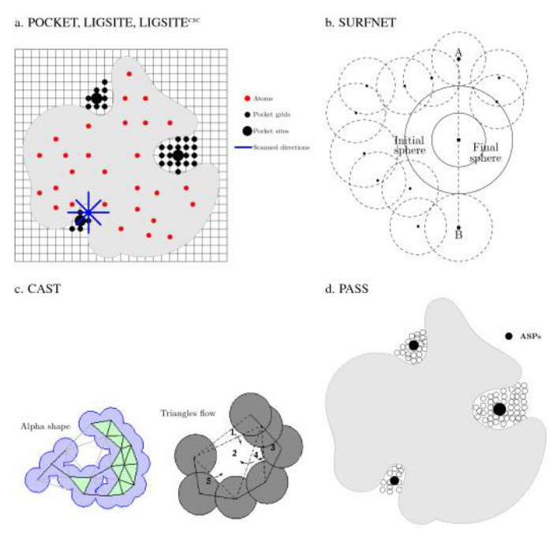

## 7.2 Small molecule-protein interactions
### Virtuell screening
Range of *in-silico* techniques for searching large compound databases to select a smaller number for biological testing

### Ligand based methods
#### Similarity searching
Structurally similar proteins tend to have similar properties
Three components are used for measuring the similarity between 2 molecules:
- Molecular descriptors:
  - Physicochemical properties
  - 2D and 3D properties:
      - 2D fingerprints encode in a binary (boolean) array the presence of subfragments in the molecule (i.e CHOH terminal group)
      - 3D fingerprints: Encode more information than 2D fingerprints, such as concrete relationships of atoms and distances, torsion angles...
- Similarity coefficient: Quantitative measure of simiilarity
  - Tanimoto coefficient: Used to transform vectorial similarity into a numeric similarity measure: $SIM_{RD} = \frac{Shared bits}{Bits_{molA} + Bits_{molB} - Shared bits}$
  - Aligment-based 3D similarity: Molecules are aligned in 3D and their shared volumes are compared:
  $SIM_{AB} = \frac{V_C}{V_A + V_B - V_C}$
- Weighting function to integrate different data.

Resources:
[https://chem.libretexts.org/Courses/Intercollegiate_Courses/Cheminformatics_OLCC_(2019)/6%3A_Molecular_Similarity/6.1%3A_Molecular_Descriptors]()

[https://sci-hub.se/https://doi.org/10.1016/B978-0-12-801505-6.00008-9]()
### Pharmacophore
Pharmacophore are a fingerprint representation of the necessary properties for a molecule in order to be able to interact with a given target.

Resources:
[https://sci-hub.se/https://doi.org/10.1016/B978-0-12-801505-6.00010-7]()

### Machine learning methods

Resources:

[https://www.sciencedirect.com/science/article/pii/S1359644617304695](Short review about the whole lecture)

[https://sci-hub.se/10.1016/b978-0-12-801505-6.00006-5](Extensive chapter of a book)

## Protein ligand docking
Similar ligands bind to the same binding site or to dissimilar proteins if they have similar binding sites.
So, binding site prediction is vital.
Some facts about binding site that can be used for predicting them:
- There's no standard definition, so geometric descriptors are used.
- Biggest cleft corresponds to binding sites in most cases (but not all)
- Specific aminoacids tend to be more present (Arg, His, Trp, Tyr).
- The size of the binding site is not related to the size of the protein, but the number of binding sites is.

### Pocket identification methods
Several algorithmic approaches are used for the dentification of pockets.
- a. Grid scan methods: They search for protein-solvent-protein and surface-solvent-surface events.
- b. Sphere placement: Pocket is filled with spheres occupying the highest volume
- c. Triangulation of the surface: Merging small to large neighbors.
- d. Iterative coating of the molecular surface searching for atom contacts.

### Methods based on geometric pocket comparisons

#### Simplified representation
