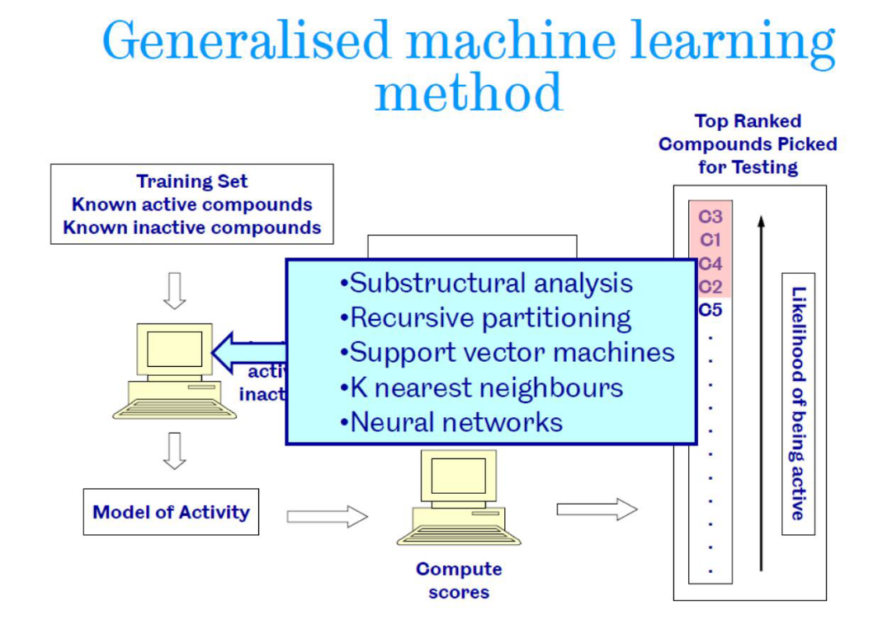
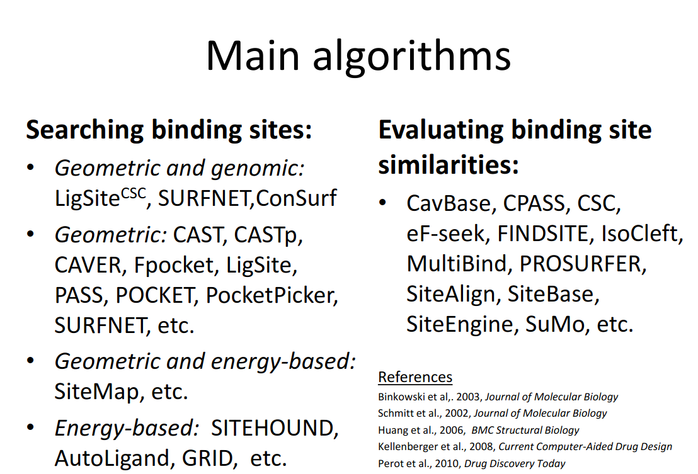

# 7.2 Small molecule-protein interactions
## Virtuell screening
Range of *in-silico* techniques for searching large compound databases to select a smaller number for biological testing

## Ligand based methods
### Similarity searching
Structurally similar proteins tend to have similar properties
Three components are used for measuring the similarity between 2 molecules:
- Molecular descriptors:
  - Physicochemical properties
  - 2D and 3D properties:
      - 2D **fingerprints** encode in a binary (boolean) array the presence of subfragments in the molecule (i.e CHOH terminal group)
      - 3D fingerprints: Encode more information than 2D fingerprints, such as concrete relationships of atoms and distances, torsion angles...
- Similarity coefficient: Quantitative measure of simiilarity
  - **Tanimoto coefficient**: Used to transform vectorial similarity into a numeric similarity measure: $SIM_{RD} = \frac{Shared bits}{Bits_{molA} + Bits_{molB} - Shared bits}$
  - Aligment-based 3D similarity: Molecules are aligned in 3D and their shared volumes are compared:
  $SIM_{AB} = \frac{V_C}{V_A + V_B - V_C}$
- Weighting function to integrate different data.

Resources:
[https://chem.libretexts.org/Courses/Intercollegiate_Courses/Cheminformatics_OLCC_(2019)/6%3A_Molecular_Similarity/6.1%3A_Molecular_Descriptors]()

[https://sci-hub.se/https://doi.org/10.1016/B978-0-12-801505-6.00008-9]()
## Pharmacophore
**Pharmacophore** are a fingerprint representation of the necessary properties for a molecule in order to be able to interact with a given target.

Resources:
[https://sci-hub.se/https://doi.org/10.1016/B978-0-12-801505-6.00010-7]()

## Machine learning methods

Resources:

[https://www.sciencedirect.com/science/article/pii/S1359644617304695](Short review about the whole lecture)

[https://sci-hub.se/10.1016/b978-0-12-801505-6.00006-5](Extensive chapter of a book)

## Protein ligand docking
Similar ligands bind to the same binding site or to dissimilar proteins if they have similar binding sites.
So, binding site prediction is vital.
Some facts about binding site that can be used for predicting them:
- There's no standard definition of what's a **pocket**, so geometric descriptors are used.
- Biggest cleft corresponds to binding sites in most cases (but not all)
- Specific aminoacids tend to be more present (Arg, His, Trp, Tyr).
- The size of the binding site is not related to the size of the protein, but the number of binding sites is.

## Energetics driving the protein-ligand binding

## Measurement of the binding strength between protein and ligand
**$K_d$**: Disociation constant, measures the rate of disociation of the complex protein ligand, and measures the strength of the binding. The lower the constant the stronger the binding.

Specifity: Specifity of ligand binding is also of high interest for drug design: Ligands with low specificity are more likely to have big side effects or toxicity.
## Pocket identification methods
Several algorithmic approaches are used for the dentification of pockets.
- a. Grid scan methods: They search for protein-solvent-protein and surface-solvent-surface events.
- b. Sphere placement: Pocket is filled with spheres occupying the highest volume
- c. Triangulation of the surface: Merging small to large neighbors.
- d. Iterative coating of the molecular surface searching for atom contacts.

## Methods based on geometric pocket comparisons

### Simplified representation

First, pockets are indentified, from the surface shape or from the distance between the residues involved and a crystallized ligand.
Residues involved in pockets are then transformed into a simplified representation of the 3D coordinates of the atoms involved or of **pseudoatoms** (properties of groups of atoms related to the pharcopore, such as aromatic groups, H-bond donors...)

Resources:

[https://pubs.acs.org/doi/10.1021/acs.accounts.5b00516]()

Whole section: [https://www.sciencedirect.com/science/article/pii/S2001037014600179]()

### Search for the best structural alignment of the simplified pocket

Different possible approaches:
#### Exhaustive search
Iterative search for the best translation/rotation, done in two steps:
- Search for similar regions
- Exploration of those regions
Is simple conceptually but is slow.
#### Geometric searches
- Geometric hashing
[https://user.ceng.metu.edu.tr/~tcan/ceng465/Spring2006/Schedule/geohash.pdf]()
- Graph based: Graph representation is invariant to rotations and translations. Patterns are represented as nodes, and they are connected by edges with weights corresponding to their physical distances. Then, the maximal subgraph isomorphism is found, using graph product and finding the maximum clique in the graph product, using for example Bron-Kerbosch algorithm.

### Scoring similarities

Similarity between predicted cavities have to be scored in order to find candidate proteins with similar functions, etc.
There's not a single best measure of structural similarity, so several can be used, for example:
- Tanimoto coefficient, RMSD, sequence similarity measured by Smith-Waterman, comparison of cavity fingerprints...
Each has advantages and datasets where are good predictors of homology, and others where they behave similarly to random predictions.

### The effect of protein flexibility
Constant conformational changes in proteins add a lot of complexity to the computational problem, when it's possible to predict correctly, so they are modeled as rigid objects.
Proteins suffer conformational changes due to allosterism and ligand binding.
Usually the proteins used for training algorithms are in holo state (bound to a ligand). That adds additional imprecision.

## Protein-ligand docking

Two steps:
- Search algorithm: Generate different feasible dispositions of the ligand relative to the active site, altering its conformation, position and orientation.
- Scoring function: Quantify an estimation of the binding affinity.

### Search algorithm

It has to deal with many degrees of freedom:
- 6 due to translation and rotation
- Conformational degrees of freedom of the protein and ligand.
- The solvent is often ignored, but if considered adds complexity to the model.

Different combinations are called **poses**.

It tries to cover the search space as exhaustively as possible, but there's a tradeoff between time and space coverage.

Conformational space can be explored before docking or at runtime:
- Before docking: An ensemble of conformations is created before docking and they are treated as rigid bodies.
- At runtime, additional degrees of freedom related to the conformation of the ligand are considered and explored using methods such as MCMC.

- DOCK(1982): Rigid docking. Fills the cavity with spheres touching two atoms. The spheres become potential sites for ligand atoms. Ligand are matched to these spheres. If it's feasible it's scored. The algorithm returns the pose with the best score.

- FLEXX(1996):
  - A base is selected (a rigid core of the molecule, such as aromatic chains to start the algorithm from)
  - The base is placed in the binding site independent of the rest of the ligand
  - The ligand is constructed in an incremental way adding iteratively more molecules and accomodating its position to the binding site.

## Scoring function

- RMSD can be used to measure spatial proximity between the protein and the ligand. The idea is that lower RMSD correspond to lower $K_d$
- Lipinski's rule of five: max. 5 hydrogen bond donors, 10 bond acceptors, molecular mass less than 500 daltons, octanol-water partition coefficient log $P \leq 5$

