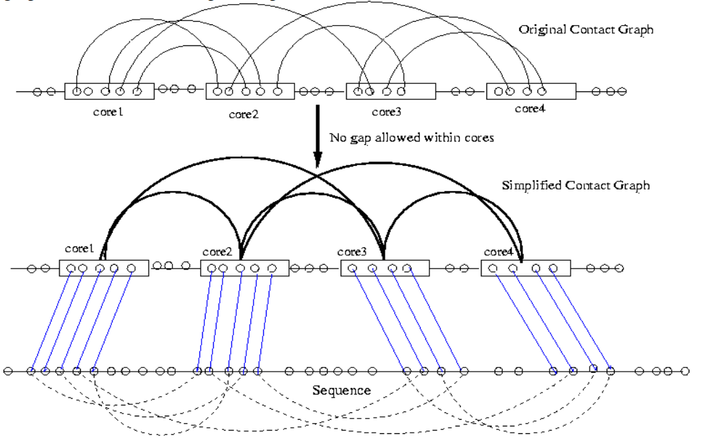
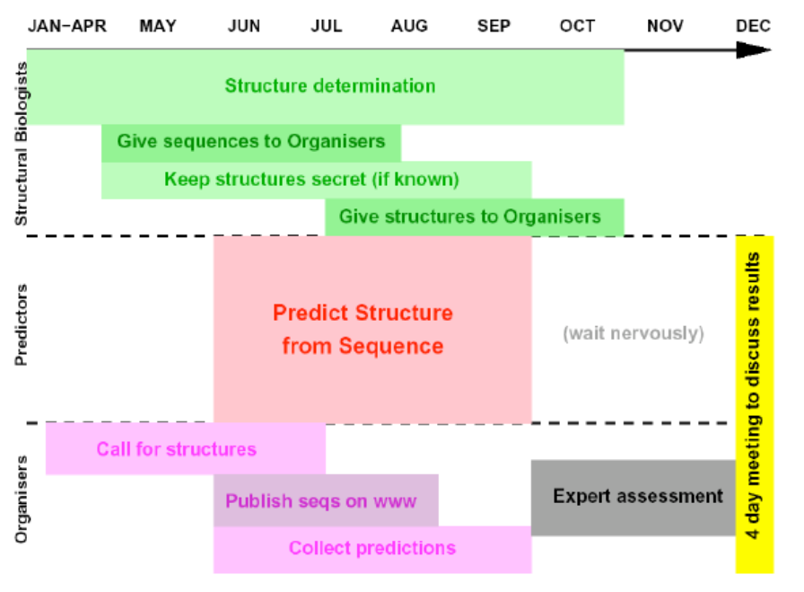
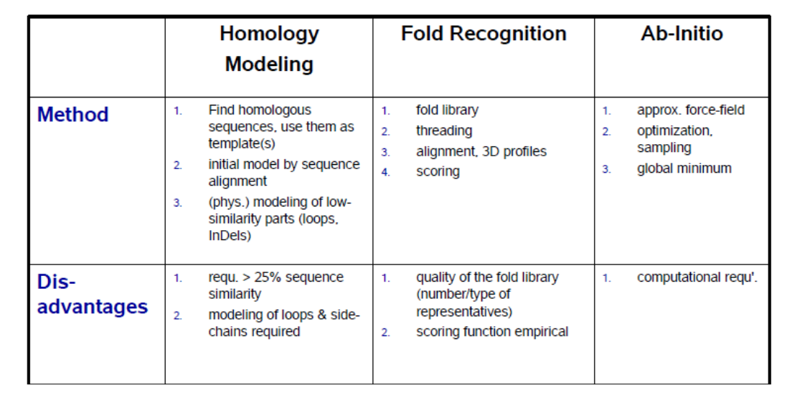

## Threading

### Introduction

Folding problem: Given a sequence find its fold

Inverse folding problem: Given a fold find the sequences compatible with it,

A given sequence can be compatible with a fold, but that sequence can have other folds with a more favorable energy.

Threading is the name given for a familiy of algorithms, which for a given sequence, and a set of folds (a template library), try to finding among template structures the fold most compatible with the sequence. For that purpose, threading "threads" the sequence along the protein while it uses as score for the alignment an energy function, which aims to be minimized.

In reality, as we've seen in another problems, considering all the forces leading to a given system's energy is computationally very expensive. So, considering all the possible correspondences between the sequence and each of the templates is computationally unfeasible. For this reason, we need efficient search algorithms and a reduced search space. Even in reduced search spaces, the search is NP hard.

### Template library

Usually the whole sequence is not considered and only the parts of the sequence corresponding to secondary structural elements are considered. Furthermore the sequences can be split by PDB chains, by different domains, by fragments...

### The scoring function

Usually the energies driving to a given fold are split into different sources:

$E_{total} = w_{single}E_{single} + w_{pair}E_{pair} + w_{gap}E_{gap} + w_{mutate}E_{mutate} + w_{sspred}E_{sspred}$

And the individual terms are deduced from relative counts of certain patterns in knowledge based on the analysis of databases and the boltzmann distribution. The w corresponds to weight to account for the different importance of each energy.

- $E_{single}$: Individually it describes the interaction of a residue of a given type with its environment (secondary structure and position relative to the surface of the protein). The whole term considers the effect of all residues in the sequence.

- $E_{pair}$: Quantifies the energy of the pairwise interactions. For that purpose, usually the pairwise interactions of the different residue types, measured from different atoms ($c_\alpha - c_\beta, c_\beta - N...) and at different distances is considered.

- $E_{mutate}$: Quantifies how well the sequence mutates into the template target sequence, based in classical distance matrix like PAM or BLOSUM.

- $E_{gap}$: Gap penalty scoring gaps in the alignment.

- $E_{sspred}$: Quantifies the compatibility between the second structural elements found in the query sequence (if known) and the template structure.

### Heuristic reductions of the search space:

There are several methods needed for making the search of possible configurations more efficient:

#### 3D profiles
Account mainly for $E_{single}$, the 3D structure of the template sequence is reduced to a sequence discretized environmental categories (can also be split by secondary structural elements):

the score of each residue is given by $s_{i,j} = \frac{ln(P(j|i))}{P_i}$, where $P(j|i)$ is the probability of finding residue i in environment j, and $P_i$ is the overall probability of i among all classes

3D profiling example (Bowie et al.):
- Align the sequence with the 3D profile(s) using dynammic programming allowing insertions and deletions
- Optimal gap penalties chosen empirically
- Score of the best alignment is tabulated
- Mean value and stdev of the alignments scores for all sequences is tabulated.
- The match is expressed by its Z-Score $\left(Z = \frac{score - \mu(scores)}{\sigma^2(scores)}\right)$
- All Z above 7 are considered
- DP is fast, but it gives an incomplete description of the environment and doesn't take into account pairwise or higher order energies.

#### Contact graph (core threading)

- Only the secondary structural elements (cores) are considered, and furthermore, some selected contacts are considered.
- It can allow or disallow gaps into those cores, leading to different search complexities. Gaps are allowed in loops.
- Core segments are not allowed to overlap

### Finding global optimality in threading

There's no proabilistic model for quantifying the probability of a given template being the correct fold of the sequence.

Confidence measures are used instead:
- Raw score
- z-score  with respect to random sequences
- p-value
- Classification with ML methods

### Some examples of threading algorithms

#### Pairwise threading optimization algorithms

#### Threader

Calculates pseudo-energies by counts, splitting the distances into three categorical values (Short ($k \le 10$), Medium and Long (k > 30), considering several different atom pairs and adding solvation potential)
#### Lathrop & Smith

### Branch and bound

The branch and bound method is an exact method for searching for an optimal alignment, but it takes exponential time in the size of the protein. The algorithm functions by assuming that each solution can be partitioned into subsets, and that the upper limit on a subset’s solution can be computed quickly. In the diagram, each circle illustrates the space of possible threadings, the solid lines indicate partitions made in a previous step, and dashed lines indicate partitions made in the current step. Furthermore, numbers indicate lower bounds for newly created subsets, and arrows indicate the set that was partitioned. Branch and bound selects the subset with the best possible bounds, subdivides it, and computes a bound for each subsequent subset. The aspects of this search which determine its efficiency are how the lower bound for the set of possible threadings is computed, and how the threading set is partitioned into subsets. Ideally, the lower bound should take into consideration the interaction of the set with the preceding set, and the best interaction with other sets. A threading set is partitioned by selecting a core segment, and choosing a split point in the set.

## CASP (Critical assessment of techniques for protein Structure Prediction)

CASP is a "benchmark" for measuring the accuracy of the different state of the art protein prediction pipelines. It's needed, because scientists are biased and it's difficult to compare methods fairly.
Its goals are:
- Establish capabilities and limitations of current methods of modeling protein structure from sequence
- Determine where progress is being made
- Determine where the field is held back by specific bottlenecks.
Methods are assesses on the basis of the analysis of a large number of blind predictions of protein structure.

## Overview of protein structure prediction

