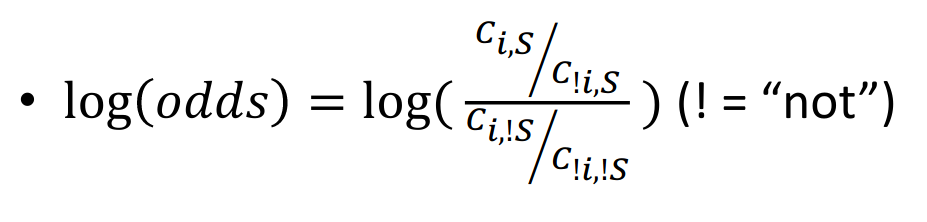
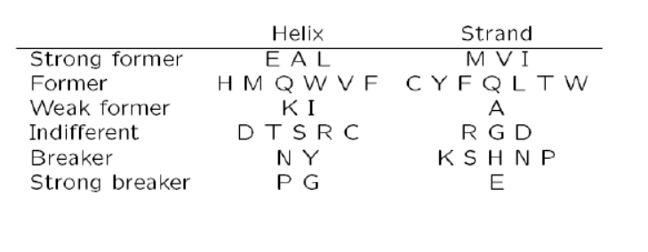
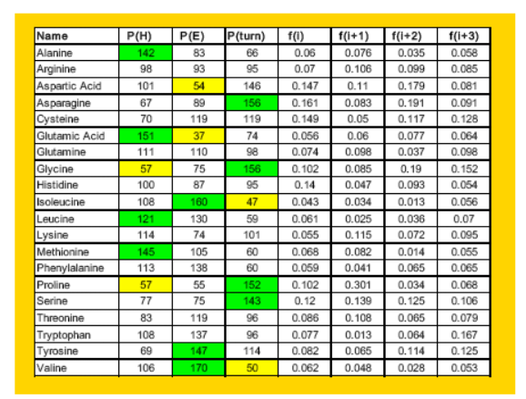
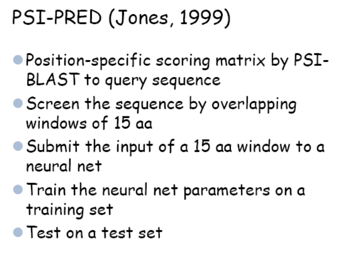
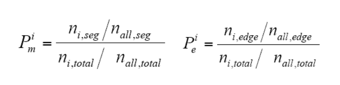

## Lecture 8
### Introduction
Prediction of secondary structure is an important step towards the prediction of the whole 3D structure. It determines up to some point the global fold.

The driving forces can be assumed to be found in the local characteristics of the polypeptide chain.

3 main target classes:

- $\alpha$-helix (H) : HB i-i+4
- $\beta$-sheet (E) :
- random coil ( C)

All three classes have a similar frequency.

Other classifications:
- Turns (T)
- $3_{10} - helix (G, HB i-i+3 )$
- $\pi-helix (I, HB i-i+5)$
- parallel/antiparallel sheets
- Bend (S)

#### Helix dipole moment
Alpha helix has an overall dipole caused by the dipoles of the carbonyl groups found in the peptide bond, all pointing along the helix axis, resulting in a positive dipole towards the N-terminus.

This overall dipole can destabilize the helix. That's why alpha helices are often capped by a N-terminal positively charged aminoacid.

This dipole is also of importance because the N-terminal positive charge can be often used to bind negative charged ligans, such as phosphates.
### Amino Acid propensities
Aminoacids are observed at different frequencies in the different secondary structural element types.

These propensities can be used to predict secondary structure.


Log(odds)


Aminoacid classifications:


Different methods can make use of already determined propensities:
####Chou-Fasman method
- Uses table of propensities derived from CD spectroscopy data of soluble, globular proteins.
- Likelihood for each aminoacid

Pseudocode:
```
Chou_fasman(sequence):
    assign all residues parameters
    for the whole sequence: #determine alpha helix
        indentify region where 4/6 have P(H)>100
            while(set of four has mean(P(H)) > 100):
                Extend alpha helix
    for the whole sequence: #determine beta sheet
        indentify region where 3/5 have P(E)>100
            while(set of four has mean(P(E)) > 100):
                Extend beta sheet
        if average(PE of betasheet) > 105 and P(E) > P(H)::
            mark region as beta sheet
        else:
            discard
    for the whole sequence: # determine turn
        p(t) = f(j)f(j+1)f(j+2)f(j+3) # Likelihood
        if p(t) > 0.000075 and average P(turn) > 100 in tetrapept
        and P(turn) > P(H) and P(E):
        tetrapet is a turn
```

Problem: it doesn't take into account the structure of the neighbors
#### The gor method
- Built on Chou-Fasman values.
- One matrix for each feature
- Evaluate each residue plus 8 in each direction (sliding window of 17)
- Underpredicts beta strand

#### Supervised machine learning methods
- Train your algorithm on training dataset and evaluate on test dataset.
- k-nearest neighbor methods: Define a starting point as centroid, enclose close elements until k training examples are selected and label them by majority vote.
  - Application to proteins:
    - make a table of sequence windows from proteins with known structure
    - find 50 best aligments with this table
    - score frequencies of different structures in the middle position
    - Scan sequence for series of high scoring predictions
- Neural Networks can (and are often used) for protein predictions. The general idea of neural networks is to reproduce the structure of neural tissue: Dendrites receive the inputs and the neuron body integrates it in a single output (normally with help of an output sigmoidal function). The algorithm learns the weights of the different inputs, working as a linear transformation ans passes it to the next layer/output.



### Physical approach towards helix prediction(AGADIR)
Based on Helix-coil transition theory, general for polymers but often used for proteins. Tries to capture the difference in energy between a coil random structure and an $\alpha$-helix.

$\Delta G_{helical-segment} = \Delta G_{Int}+\Delta G_{Hbond}+\Delta G_{SD}+\Delta G_{nonH}+\Delta G_{dipole}$

where:

$\Delta G_{int}$ are the intrinsic tendencies of the residues to adopt helix conformation.

$\Delta G_{Hbond}$ are the contributions of main chain and i, i+4 hydrogen bonds

$\Delta G_{SD}$ Sums the net contributions with respects to the random coil state of all side chain interactions.

$\Delta G_{nonH}$ Captures the contribution to stability of N and C terminal residues.

$\Delta G_{dipole}$ represents the iteraction of charged groups with the helix macrodipole

### Trans-membrane element prediction

Trans membrane proteins constitute 30% of all proteins in a cell, and receptors are an important target for pharmaceutical industry.

Aminoacids are differentially hydrophobic, and that's often used for prediction of transmembrane elements.

Structurally, they tend to have charged residues flanking hydrophobic segments, and the positively charged extrem tend to face towards the cytoplasm (weaker in Archaea).

Sometimes they also have amphipathic $\alpha$-helix after the hydrophobic region to interect both with the environment and the cell layer. They tend to have a repetitive structure of charged and hydrophobic residues alternating with a repeat distance corresponding to the period of the structure. This can be seen in a helical wheel plot and hydrophobic moments (a vectorized representation of the hydrophobicity of the sequence).

The starting point are propensity tables for the different aminoacids representing how likely is for a given aminoacid to interact with water.

Both for flanking and hydrophobic region are calculated.


There are different likelihood tables:
- Kyte-Doolittle hydropathy.
- Hopp-Woods hydrophilicity.
- Eisenberg et al. normalized consensus.

Basic hydrophilibity plot: Calculate average hydropathy over a window and slide window until the entire sequence has been analyzed


Also markov-chain models are used to solve this problem, and neural networks.

$\beta$-barrel element prediction is mostly based on hydropathy analysis and similarity search.


#### performance assessment
Biggest databases result in more accurate predictions.
- Qindex: Percentage of residues correctly predicted as $\alpha$-helix,coil... the score is high even for random predictions. $Q_3 = \frac {N_{predicted}}{N_{observed}} \cdot 100$
