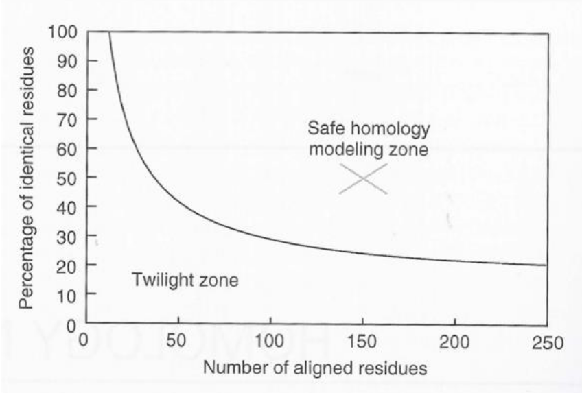
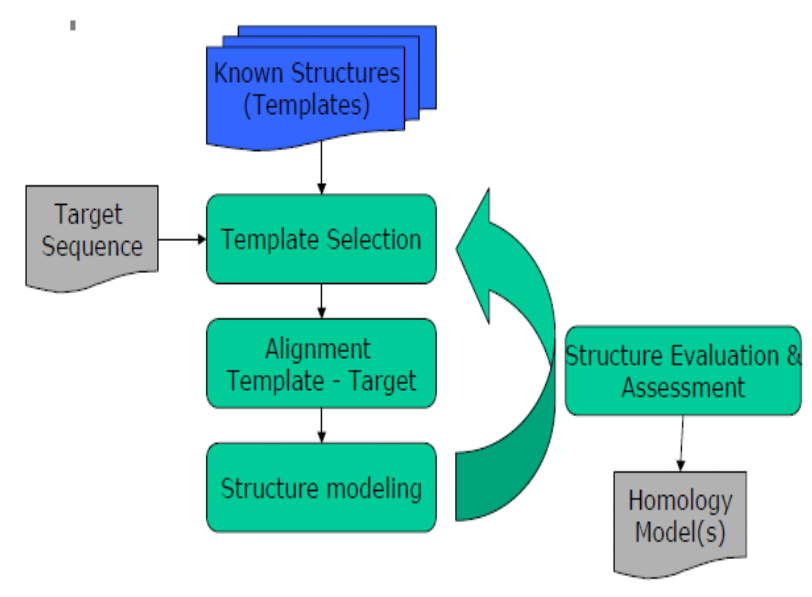
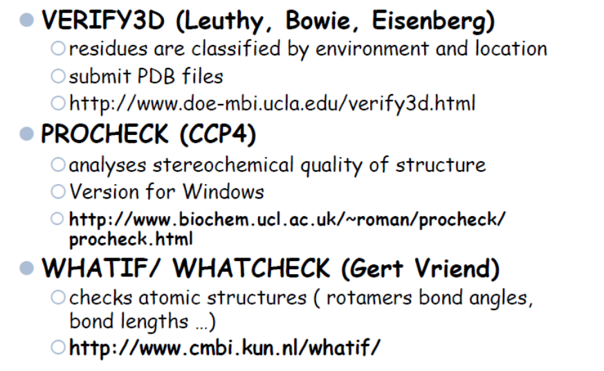
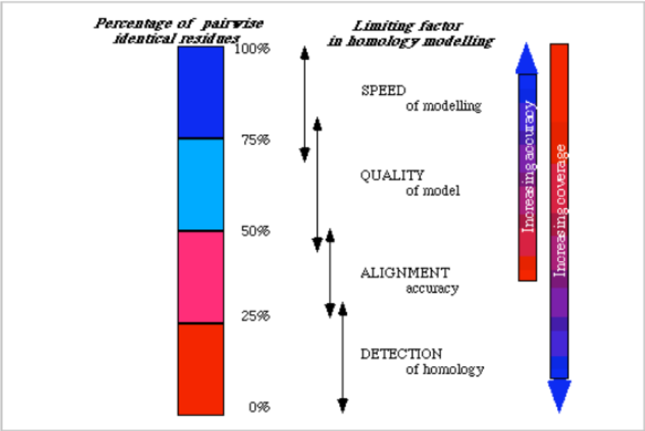
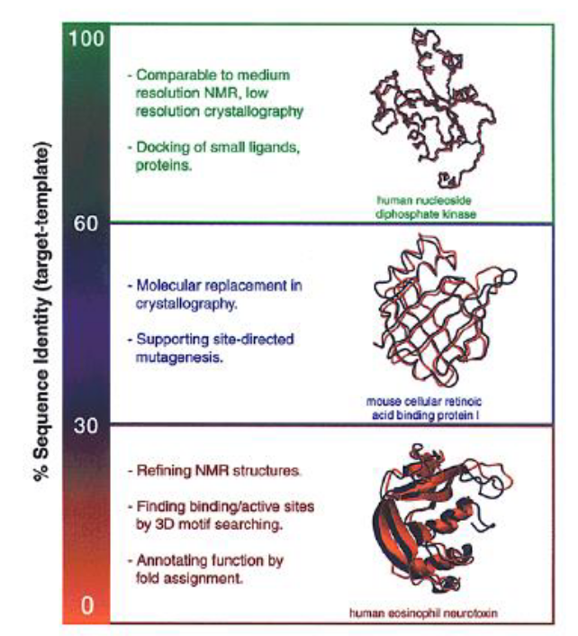
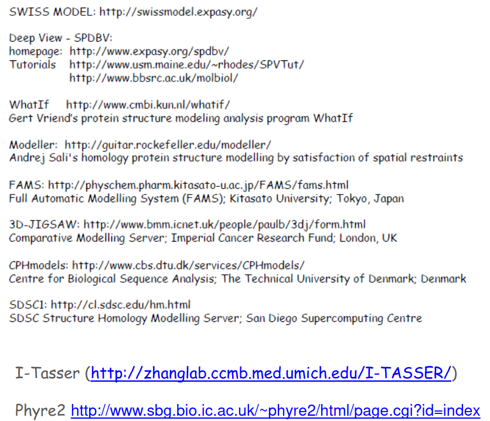
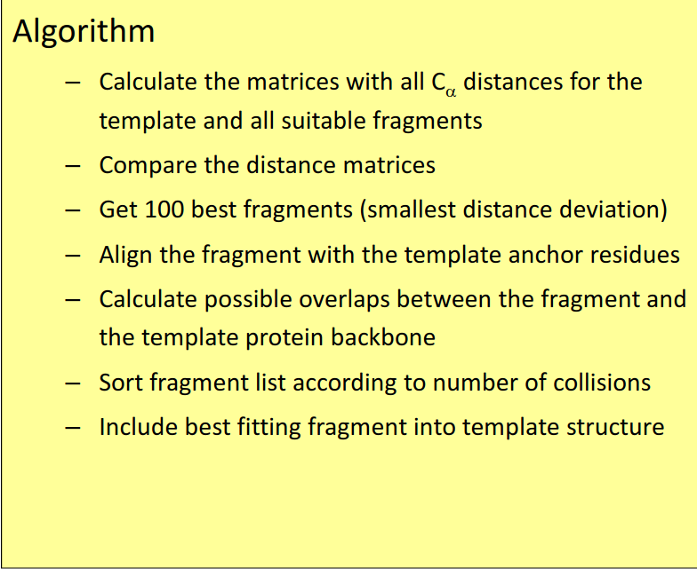
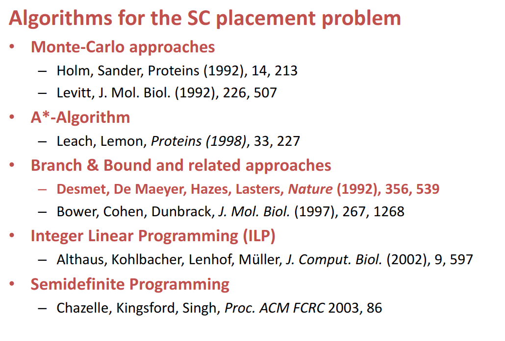
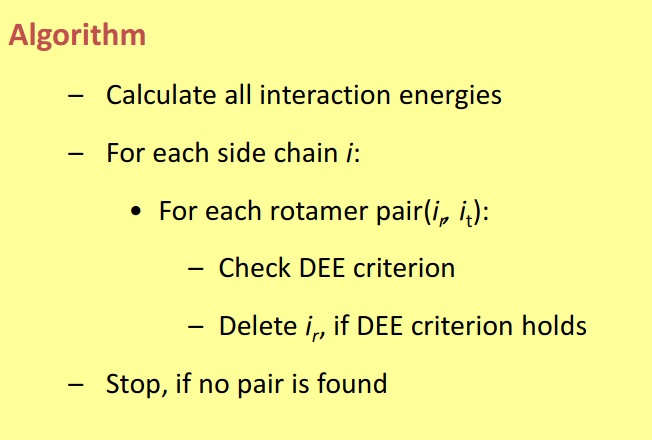

## 8 - Homology modelling of protein structure prediction

### Introduction

The number of protein structures known in the PDB has grown steadily but at a much lower pace than the number of sequences found in Uni-Prot.
Homology tends to conserve both tertiary and secondary structure, solvent accesibility, and finally function.
That's why homology is a valuable information that can be used for structure prediction.
Basic assumptions:

- Similar sequence = similar structure $\implies$ homologous proteins have similar structures. But it's not always true, as very diverging sequences can have a high structural homology.

### Homology derived secondary structure of proteins (HSSP plot)

The correct inference of a shared secondary structure by the level of homology between the two sequences depends on the length of the alignment (x axis) and the percentage of homology (y axis).

### Homology modeling

#### Template selection

Done in function of:
- Sequence similarity (>25%, greater is better). For this purpose BLAST or PsiBLAST can be used.
- Quality structure (resolution in A)
- Experimental conditions

Usually iterative cycles of aligment, modeling and evaluation are done in order to choose the best model possible.

#### Alignment Template - Target

Using dynamic programming, and probably a MSA.

The regions related to secondary structural elements should be conserved, because changes in those regions are likely to result in proteins with different global structures.

#### Structure modeling
- *Backbone generation*:
  - We place the coordinates of the sequence found to be homologous in the database.
  - It's often almost trivial and has the goal of providing an initial guess.
  - N, Cα, C and O and often also the Cβ can be copied if two residues differ.
  - The side chain can be also placed if the residues are the same
- *Loop modeling*:
  - In most cases alignments contain gaps.
  - Gaps in the model sequence are adressed just omiting those residues.
  - If there's an insertion in the model sequence, residues are placed inbetween.
  - Loops of different sequence are hard to predict.
  - there are two main approaches:
    - Database searching of known loops with the same endpoints and similar length. $\to$ Copy coordinates (works better for short loops), or similar loops are clustered and used as a consensus (i.e BRAGI, LIP).
    - Ab-initio: Energy based, huge search space $\to$ montecarlo methods (i.e Moult & James).
- *Side chain placement*
  - Cast as an optimization problem
  - Find the **torsion angles** of the side chains and **position** of all SC **atoms**, given **fixed backbone coordinates** and an initial guess for the SC positions, resulting in the **minimum global energy**.
  - The number of possible combinations is huge, sidechains can have several dihedral angles.
  - The packing and interactions are neighboring interactions are difficult to take into account.
  - But certain backbone conformations strongly favour certain conformations which leds to a possible reduction of the search space: Some individual angles are much more frequent than others, and the same happens for some combinations of dihedral angles. Those feasible conformations in the torsion angle space are called rotamers, and can be found in rotamer libraries (see below).
  - NP-Hard problem. Only simple energy functions can be used for estimating the energy of the placement, but they have to distinguish torsions of the side chains and pairwise interactions between side chains and with the backbone.
  
  - Reduced time complexity thanks to dead elimination algorithm from $R^L$ to $RL^2$ to (below), where R is the average number of romaters per position and L the number of residues.
- *Model optimization*:
  - Its aim it's the correction of clashes and other local problems more than the finding of a different better model.
  - iterative procedure:
      - Prediction of rotamers
      - Prediction of shifts in the backbone
      - Repeat until convergence
  - MDS and energy minimization are often used.
  - Used force fields: AMBER or CHARMM
  - Errors in homology models
    - Use of wrong templates
    - Incorrect alignment
    - Errors in the template
    - Distortion in correct aligned regions
    - Errors in side chain positioning
- *Model validation*
  - Checking bond lengths, bond and torsion angles
  - Inside/outside distributions of polar and apolar residues to detect completely misfolded models
  - Potentials of mean force for atom contact distance
  - Comparison with other homologous proteins, checking if important regions are conserved.

#### Applications

#### Resources

#### DB-based loop placement
#### Bragi

#### LIP
- Loops are clustered according to length and distance
- Fitting the consensus by superimposition of the main atoms in both terminal ends.
- Uses sequence similarity and a loop-specific scoring matrix.
- Scores the different loop candidates with a ranking function derived from the RMSD for the mentioned atoms.
#### Ab-initio loop placement
#### Moult & James
- Search possible backbone torsion angles based on Ramachandran possible combinations.
- Add side chains using romaters
- Score by energetic parameters

####CONGEN
- Uses discrete angles allowed by the ramachandran plot regions
- Special treatment of Gly and Pro\
- Energies calculated using CHARMM force field
- Side chains constructed in parallel

#### Rotamer libraries: BBind/Bbdep and SCRWL
Most used rotamer library, with two variants: Backbone-independent and backbone dependent. Contains up to 81 rotamers per aminoacid.
Backbone-dependent are given for binned phi/psi angles.
For every rotamer the following values are given:
- Frequencies
- Torsion angle
- Conditional probabilities on other rotamers
- Standard deviations
For long sequences it cannot be systematically scanned.

#### Dead end elimination algorithm
Proposed by Desmet et al. and Branch&Bound-like
It states that if for two rotamers $i_r$ and $i_s$:

$E_{i_r} + \sum _j min _s E_{i_r, j_s} > E_{i_t} + \sum _j max _s E_{i_t, j_s}$

Then $i_r$is not part of the optimal solution, because the lowest energy while using $i_r$ is higher (hence "worse") than the highest energy using $i_t$

Remaining search space can be tested by enumeration.

### Side chain modeling qualiting assessment
Highly dependent on the search algorithm used and the quality of the rotamer library.
Quality measures:
- Percentage of correct $\chi _1$ assignments
- Percentage of correct $\chi _1 + \chi _2$ assignments

In general the process is more accurate for side chains in the hydrophobic core and low for surface residues, due to the presence of charged AAs, which can adopt many rotation angles and can rotate the charged end influenced by surrounding water molecules.
