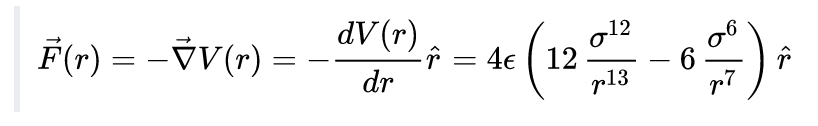
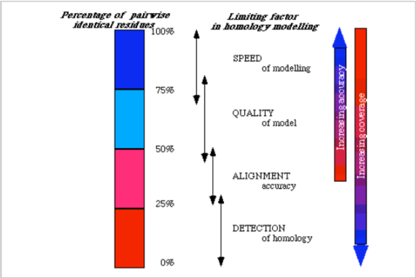
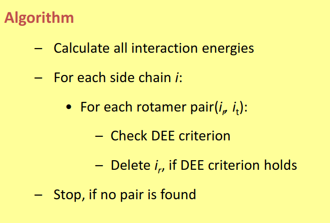
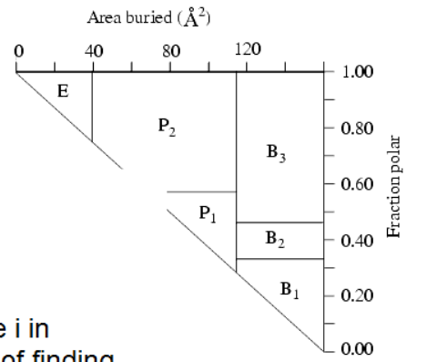
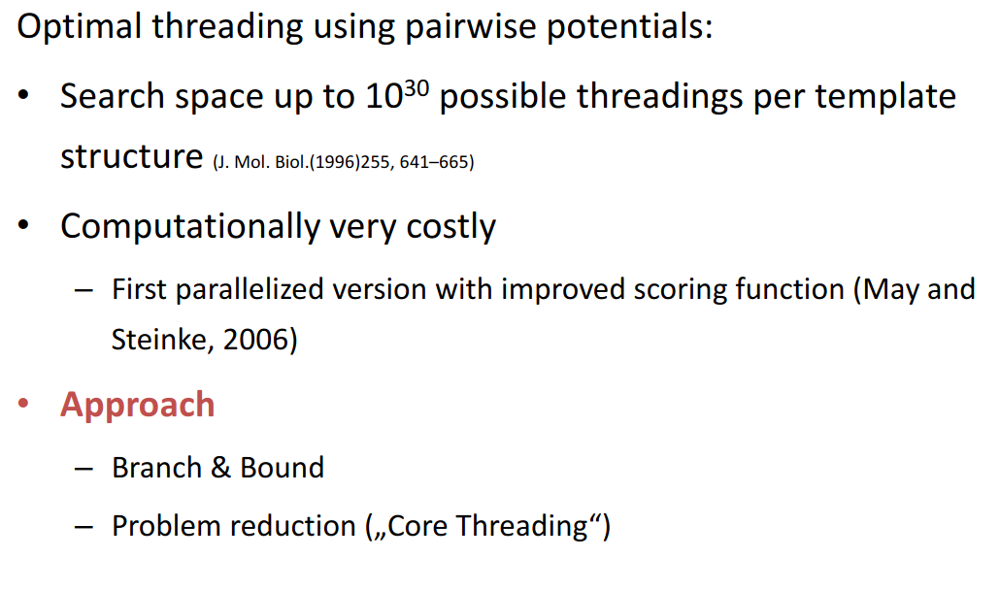

# 4 The protein folding problem
## Introduction
In the 50s, Anfinsen experiments:
- Used Mercaptoethanol to reduce disulfide bridges
- Urea to denaturalize due to low PH
- Observed how the protein folded back to its native conformation.
- added notes (If the renaturalization of the protein was too fast, it could fold to a wrong structure. Furthermore, other proteins need chaperones to fold properly)

## Anfinsen's dogma: The thermodynamic hypothesis

Proteins adopt structures that corresponds to their global minimum of free energy:

$\Delta G = \Delta H - T \Delta S$

Protein folding problem can be restated as finding the structure corresponding to the global minimum of free energy. Different several characteristics of the folding affect the energy state of the system, and these can be represented mathematically using different expressions, where usually there exists a tradeoff between accuracy modeling the physical term and complexity of the mathematical expression. In the following, some options for modeling those will be presented.

[https://manual.gromacs.org/documentation/current/reference-manual/functions/bonded-interactions.html]()

## Energetics of protein folding


### Non-covalent interactions
#### van der Waals interactions

Correspond to:

- Permanent dipole-permanent dipole forces
- Permanent dipole-induced dipole forces
- instantaneous induced dipole-induced dipole(London dispersion forces).


##### Lennard-jones Potential:

$V(r) = 4 \epsilon \left[\left(\frac{\sigma}{r}\right)^{12} - \left(\frac{\sigma}{r}\right)^{6}\right]$

- The first term with power 12 represents the repulsion between the particles
- The second term with power 6 represents the attraction.
- $\epsilon$ represents the depth of the dwell
- $\sigma$ represents the r with V = 0
- r is the distance between two particles
- Notice that $\frac{\sigma}{r}$ < 1 if the particles are further than $\sigma$, and in this case the attraction term is bigger, and the function tends to 0 from below as r grows.
- and $\frac{\sigma}{r}$ > 1 if the particles are further than $\sigma$, and in this case the repulsion term is bigger, so V tends to infinity as r goes to 0 (highly unfavorable energetics)
- Both terms have even exponents, so the function has a global minimum.


The force can be derived from the gradient of the formula:



#### Ionic (electrostatic) interactions

Attraction between particles of opposite net charge(positive or negative), and repulsion between particles of the same symbol. In general these forces are depending additively of the net charge, and are strongly influenced by the characteristics of the solvant. It can represent the interaction between ions, and between ions and dipoles.

Usually modeled using Coulomb's law, which in vectorial form is:

$E_{vacuum}(i, j) = \frac {q_1 q_2}{4 \pi \epsilon _0 r_{ij}^2}$

where:

- $\epsilon _0$ is the electric constant in vacuum
- $q_i, q_j$ are the net charge of the two particles
- $r_{ij}$ is the distance between the particles

and for other media we have:

$E_{medium}(i, j) = \frac {1}{D_{medium}} \cdot E_{vacuum}$

Where $D_{medium}$ represents the dielectric constant of medium (80 for water, 2-3 for protein interior)

Also can be used for modeling dipole-dipole interactions, where the dipole moments have to be considered.

### Covalent interactions

Derived from the distances, angle... of the covalent bonds.

#### Covalent bond distance

Can be described using Morse-potential or approximated using harmonic potential.


##### Morse potential

$E_{morse} = D(1 - e^{-B(r-r_0)})^2$

where:
- $D :=$  the well depth
- $B :=$ the width of the well
- $r_0 :=$ equilibrium bond distance
- $r :=$ actual bond distance

##### Harmonic (quadratic) potential

$E_H = k_{ij} (r_{ij} - r_0)^2$

where:
- $k_{ij} :=$ bond specific shape of the function
- $r_0 :=$ equilibrium bond distance
- $r :=$ actual bond distance

#### Covalent bond angles


##### Single bonds
**Single Bond angle vibration** is represented by an harmonic potential too, but is less stiff than the bond distance.

$V_{a}(\theta_{ijk}) = k_{ijk}^\theta (\theta_{ijk} - \theta_0)^2$

##### Dihedral angles
**Dihedral angles** present a periodic behaviour energy-wise.


The different conformations of side chains due to rotatable bonds are called rotamers.

Torsion energies of the dihedral angle are described by the angles and their multiplicities, and are the source of conformational flexibility for the same protein structure.

A possible form for modeling this:

$E_{tors} = k(1 + cos(n \tau - \tau_0))$

- $\tau :=$ Dihedral angle
- $n :=$ Multiplicity
- $k :=$ constant depending on the atom types defining the dihedral angle

##### Disulfide bonds

Frequently formed in smaller proteins where are needed for the stabilization, because non-covalent forces are too small

### Solvation energy

The interaction of a protein with the solvant has a big impact on the energetics of the system. Solvation involves bond formation, hydrogen bonding and Van der Waals forces.

Solvation energy is the term used for describing the energetic change of the system due to this interactions, which wouldn't occur in vacuum.

Every atom has a specific solvation energy per surface, which can be computed, but it's expensive. Considering all pairwise interactions between the protein and the water molecules in in practice not done, due to the large number of degreees of freedom needed to model water.

A simplified model assumes that solvation energy is proportional to the surface area buried after folding.

**Born energy** is the term used for describing the change in free energy of transferring an ion from a medium of low dielectric constant (i.e the interior of the protein) to one of high dielectric constant (i.e the surface in contact with water).

### Hydrophobic effect

The hydrophobic effect is the observed tendency of nonpolar substances to aggregate in an aqueous solution and exclude water molecules, and constitutes the strongest driving force for protein folding.

Water forms ordered arrangements (cages) around hydrophobic solutes, with low entropy. If hydrophobic sidechains are packed together, the entropy of the solvent is higher, which is energetically favorable.


## Entropy. The folding funnel

Under statistic mechanics, entropy is proportional to the number of possible microscopic configurations (microstates), which could give rise to the observed macroscopic state (macrostate) of the system.

Boltzmann entropy equation:

$S = k_b ln(W)$

where:
- $k_b :=$ Boltzmann constant
- $W :=$ the number of microstates

Clasical thermodynamics:

$\Delta S = \frac {\Delta Q_{rev}}{T}$

Applied to proteins:
- In unfolded state, many conformations for bond angles, sidechains... are possible, the entropy is high.
- In folded state, only one (or a few) microstates are possible, hence the entropy is low.

In order to be able to fold, proteins have to compensate this loss of entropy by enthalpic contributions.

Furthermore, how do proteins find the lowest energy state?

### Models for protein folding

The **Levinthal paradox** states that the number of possible conformations that can be reach by a protein with a certain sequence is so high, that if proteins would "try out" all of them until they found the right one, it would need more time than the current age of the universe to find its correct fold.

In conclussion: Protein folding is not a random or exhaustive search, it occurs along a gradient towards the global minimum, as visualized in the **folding funnel**.


Some properties of this model:
- Different initial conformations lead to the same global minimum
- Local minima can act as kinectic traps, that also can correspond to alternative foldings.

#### Two-state folding model

- Only considers two states (folded and unfolded)
- recquires cooperavity
- likely true for small proteins

### Step-wise folding model

- 1. Formation of structural elements
- Condensation of preformed elements into 3D structure

### Lattice proteins folding model


- Highly simplified model for protein folding.
- It considers the folding as a path on a 2D or 3D grid.
- Polar and hydrophobic residues are considered separately
- Estimates the energetics in function of adjacency in the lattice.

# 5 Prediction of protein structure

## Introduction
Thermodynamic hypothesis: Proteins fold into the conformation of minimal free energy. By finding this minima we can solve the protein folding problem.

Proteins are flexible, and this is essential for function. This can be simulated in several ways, with different degrees of accuracy.


## Classical mechanics

Is the easiest method computationally speaking.
Models forces using hook's law (harmonic potential), doesn't take into account quantum effects and doesn't treat electrons explicitly.
The time complexity of considering bond mediated interactions is $O(N)$. Considering spatial interactions, is $O(N^k)$, where k is the number of elements considered for the spatial interactions.

## Force fields
A force field is a model whose objective is describing the energetic landscape of the different possible conformations of a molecule. For that purpose a force field describes the interactions through different analytical forms, and contains also knowledge-derived parameters that make possible this modelization and rules to associate parameters to atom types.
They can make use of different treatments of the analytical forms (classical treatment, ML derived...)
Parametrization can be:
- Based on quantum-mechanics calculations
  - Exotic geometries are accesible
  - Critically depends on choice of modeling method
  - inexpensive
- Based on experimental data
  - Limited by the scarcity of good experimental data
  - Only natural geometries are accesible

Some examples of Force fields often used for protein structure prediction are AMBER, CHARMM and GROMOS.


### Example 1: ECEPP/2

- Models bond lengths and angles as stiff, so they are constraints and not parameters.
- The conformational flexibility is derived from different dihedral angles.
- Van der waals interactions are modeled using Lennard-Jones-potential
- Electrostatics using Coulomb
- Torsions using cosine-term
- H-Bonds using 10-12 potential are treated as non-directional electrostatic interactions

### Example 2: AMBER (Assisted Model Building with Energy Refinement)

Five contributions:
- Bond lengths ($E_{stretch}$)
- Bond angles ($E_{bend}$)
- Dihedrals ($E_{tors}$)
- Van-der-Waals ($E_{vdW}$)
- Electrostatics ($E_{ES}$)

$E = E_{stretch} + E_{bend} + E_{tors} + E_{vdW}+ E_{ES}$

It also uses additional constraints to keep planar systems (aromatic rings) planars.

It uses 54 different atom types, i.e:
- C - $sp^2$ carbon in carbonyl group
- CT - Aliphatic sp^3 carbon
...

### Class II Force Fields

- Make use of Anharmonic potentials (i.e Morse potential, more accurate than harmonic potential for describing bond energecits)
- Include cross terms, describing coupling between different terms (e.g. bond lengths and angles)

## Modeling of particle motion
Can be modeled using classical mechanics in function of position velocity and acceleration: Three newton laws of motion.

Acceleration: can be computed derived from forces and masses thanks to the equation:

$a = F/m$

Force can be derived,as commented, from the energy thanks to the equation:

$F(r) = - \nabla E(r)$

where $\nabla = \left(\frac{\partial}{\partial x},\frac {\partial}{\partial y}, \frac{\partial}{\partial z}\right)$

Then this information can be used for creating a system of linear equations, which can be numerically solve yielding a simulated molecular dynamics.

### Trajectory

Trajectory: the path that an object with mass in motion follows through space as a function of time.

Trajectories can be found integrating the equations of motion.

### Phase space
The positions of the elements of the system is not sufficient to describe the state of a dynamic system.

Phase space: Positions + momentums of the elements of the system describing its state.

## Molecular dynamics simulations (MDS)

Simulation of the dynamics of molecular systems based on force fields and associated equations of motion.
e.g Derivatives of AMBER terms.

They can make use of cut-off radii: Compute interactions only with molecules in a ball centered on the particle with a given radius. but:

They introduce discontinuities (solved using solution-shifting functions or switching functions)


### Algorithms used for integrating equations of motion
- Motion of particles is coupled (many-body problem)
- Analytical integration not possible $\implies$ Approximated by numerical integration
- Assumption: terms expressed as Taylor-series expansion

#### Taylor-expansion
$f(x + \Delta X) = \sum \frac {1}{v!}f^v(x) \Delta x ^v$

This is an infinite power series, but are usually approximated by terminating series.

#### Verlet integration

Uses information of current and preceeding timestep to compute position and forces for the next time step.
At time t, t r(t) and r(t-$\Delta$ t are known)

$r(t + \Delta t = 2r(t) - r(t - \Delta t) + \Delta t^2 a(t))$

After the computation of the next discrete position, iteration starts again.

It can be modified to be used with velocities:

$v(t) = \frac {1}{2 \Delta t}\left(r(t + \Delta t - r (t - \Delta t))\right)$

Where also an initial condition is necessary because $t = 0$ is not defined

Time step:
- if too short the simulation takes unnecessarily long
- if too long the forces becomes too large and the simulation "explodes"


#### Simulation of water
Can be treated explicitly. But simulations become very expensive.

#### Simulations depending on T

[https://sites.engineering.ucsb.edu/~shell/che210d/Advanced_molecular_dynamics.pdf]()

If T is constant: the canonical NVT-ensemble treats pressure and energy as variables, and the different temperatures describe the tendence of the system to fold or not. If we want to consider a system where the temperature is not constant, we have to consider the changes in the molecular kinetics produced by this changes. Several different strategies:
- Velocity rescaling: At each time step, the new temperature is derived from the kinetic energy. This doesn't capture the correct kinetic energy fluctuations.
- Berendsen thermostat: Similar to Velocity rescaling, but there's an additional timescale for temperature rescaling. It suffers from the same problems as velocity rescaling.
- Andersen thermostat: It also models random colisions between particles, and particles and the heat bath, in function of a colision frequency ($\tau$), where kinetic energy is transfered. It produces the correct canonical ensemble, but true molecular kinetics are not represented.
- Other thermostats: More involved and accurate approaches.

# 6.1 Energy Minimization

## Introduction


Energetic landscape: The collection of points over the different variables $(Var1,Var2,...,VarN, Energy$) constitutes an Hyperplane.

Local Minima in this hyperplane correspond to energetically favorable conformations.

The global minimum corresponds to the fold of the molecule.

## Ensemble average
Properties of molecular systems defined by the average over all molecules.

Ensemble average weighted by relevance:
- Energetically unfavorable states do not contribute much.
- Energetically favorable, more frequent, contribute much.

Ergodic hypothesis: Time average = ensemble average.

## Strategies for searching minima

Local minima are easier to find than global minima.

### Gradient descent methods

$$gradient = \nabla = \left(\frac{\partial}{\partial x_1}, \frac{\partial}{\partial x_2}, ..., \frac{\partial}{\partial x_n}\right)$$

The gradient points towards the steepest slope of f at a given point.

It's intuitive to follow this gradient until we reach a point with $\nabla = 0$ (or a threshold for the root mean square of the gradient previously defined), which corresponds to a minima, maxima or a saddle.


#### Steepest gradient descent (SD)

- Greedy algorithm
- Always chooses direction of steepest descent
- Continue until no further descent
- Determining size of the step is critical.

Advantages:
- Simple, fast for steep gradients
- Numerically stable
- Fast and accurate for convex functions

Disadvantages:
- Slow convergence
- Search directions can be orthogonal
- Can result in zig zag searches

#### Conjugated gradient descent

It keeps memory of the last search direction.
$s = -g_k + \beta_{k+1} s_{k-1}$

Where $\beta$ is the weight of the last search direction, a parameter than needs to be set properly.

### Conformational search methods

Gradient descent methods are able to find only local minima, which can correspond to the global maximum or not.

Other methods need to be used if we want to find the global minimum for sure.

#### Systematic (grid based) search

Only feasible for a small number of degrees of freedom. It leads to combinatorial explosion very fast.

The number of degrees of freedom can be reduced drastically:
- Coordinates are not independent
- Flexibility lies in torsions
- Not all dihedral angles are feasible
- The number of possible conformations is nonetheless too big.

#### Stochastic methods

Ensemble corresponds to phase space (6N) integral.

Random sampling can be used for estimating this integral $\to$ Monte-Carlo method

##### MonteCarlo Method
Randomly sample conformational space.


Problem: Too many irrelevant conformations are sampled.

#### MonteCarlo method with importance sampling (MCMC)
The boltzmann distribution is used for building a markov chain with a sample rejection probability.
$\frac{p_i}{p_j} = e^{-\frac{E_i - E_j}{k_BT}}$

A markov chain is a stochastic model, where the current state of the system only depends on the previous state (it has no memory).


with probability of moving to a new point:

$p(x_n, x_{n+1}) = min\left(\frac{f(x_n+1)}{f(x_{n})}, 1\right)$

So, if the value of the new point is bigger, it always moves to it, if not, there-s a rejection probability.

This simulation results in a trajectory and associated energy, but there's no temporal correspondence between succesive points in the trajectory.
It's used to estimate average properties, but also to find minima as the trajectory samples favorable states more often.


#### Simulated annealing

Similar to MCMC sample, but the goal is not representing the underlying mathematical function, but finding the global minimum using a metaheuristic approach.

Adds a new parameter, T.

$p(x_n, x_{n+1}) = min\left( exp(\frac{\Delta(f(x))}{T}), 1\right)$

This results in a rejection probability dependent on the temperature: If the temperature is very high the system will act as a random walker. If it's very low as a MCMC.
#### Simulations in different coordinate space
Cartesian: Is more flexible, but has many irrelevant conformations
Torsion Space: Reduced to main variables, the search is efficient but not all conformations are possible

#### Influence of temperature in simulations


For simulations considering temperature, simulated annealing is used:
First the simulation is started with a high temperature, where the system behaves as a random walker, as we lower temperature, the system starts to reject samples, leading hopefully to the global minima, and being able to find the local minima feasible at different temperatures.

## Overview


# 6.2 DB-Derived potentials

Semi-empirical based on approximations of quantum-chemistry, such as force-fields, have a low accuracy predicting the folding of proteins. This was proved in “An analysis of incorrectly Folded protein Models” by Karplus, where it was possible to minimize the incoherences between two unrelated proteins, resulting in a false positive for homology.

This is because force-fields calculations sometimes fail to capture some interactions between side-chains or more distant atoms that result in unfeasible folding predictions.

## Boltzmann distribution

The Bolzmann distribution relates potential energy and temperature to probability

$p(x) \propto e^{\frac {-U(x)}{b_B \cdot T}}$

where T is temperature and $k_b$ is the Boltzmann constant


Key properties:
- Higher energies gives lower probability
- Exponential relationship: Constant energy increase to halve probability
- Temperature dependence: At higher temperature the energy increase has to be bigger

Sometimes it's difficult to predict the overall energy of a macro/microstate, but the probability ratio between two states can be efficiently calculated:

$\frac {N_1}{N_2} = e^{\frac{-\Delta E}{k_b T}}$

## Mean force potentials

We can estimate the difference in energy between two states from their counts using the inverse Boltzmann law:

$\Delta E = -k_b \cdot \ln (\frac{N_1}{N_2})$

Using this and taking into account different relationships (i.e. distances between $C\alpha$ that are 4 positions away in the chain), the relative frequencies of the different distances  can be used to create Boltzmann distributions of the different distances for particular cases. This are the so-called DB-derived Mean Force potentials.


### Db-derived solvation energies

DB-info can be used to derive estimations of solvation energies. For that, we define a $\delta$-neighborhood in the euclidean space of the different types of aminoacids and count the number of neighboring aminoacids, relative to the overall aa-types:

$E_{aa,r} = -k_b \cdot \ln (\frac{f_{aa,N_r}}{f_{x,N_r}})$

leading to estimations of the position of the different aminoacids to the water accesible area:


### Applications

Mean force potentials failed to be a good folding-prediction tool, but are a powerful tool for:
- evaluating the correctness of NMR structures.
- Solving the reverse folding problem (finding a sequence compatible with an observed fold).

### Weaknesses

- Lack of detail leads to implausible structures (i.e impossible in nature bond angles).
- Fails to capture interactions at a global level, and only considers interactions at the primary sequence level (multibody effect).

### Summary


# 7.1 Protein interactions
## Introduction
Protein function is determined by their interaction with other proteins:

- Transcription factors with DNA.
- Enzyme-substrate
- Complex formations.

Proteins interact with other proteins mostly through large hydrophobic flat areas
(interfaces),
where some charged residues define the orientation of the interaction.
These interactions usually involve intermediary water molecules for creating hydrogen bonds.
The contribution to the energy of the interaction is not uniform: few residues correspond
to the main part of the energy.

Protein flexibility:


Although their limits are sometimes blurred, there are three main in-silico approaches for finding protein-protein interactions:
- Based on observed 3D structures
- Based on sequence information (*ab initio*).
- Based on evolutionary relationships.

## Structure-based methods

Mostly assume protein are rigid bodies and a key-lock model.
Overview of the general algorithm:


Models use 6 degrees of freedom (X, Y, Z-rotation, translation).
Modifying those parameters they try to find the rigid transformation bringing B in contact with A.
They take into account both spatial and chemical interactions.

### Rigid body search

Proteins are discretized, transformed into a 3d matrix, where each cell can have different values:
- Larger protein's position is fixed, the bins corresponding to the core of the molecule have a negative value (penalization score), the surface has a value of one and the outside a value of 0.
- Smaller protein can have only two values: 1 in the interior of the molecule and 0 on the outside.
- Then the shape complementarity is calculated as the convolution of a on b:

  $C_{\alpha, \beta, \gamma} = \sum_{l}\sum_{m}\sum_{n} a_{l, m, n} \cdot b_{l+\alpha, m+\beta, n+\gamma}$

The objective is to maximize this function, where for each bin contributes: +1 if there's an overlap between smaller protein and surface of bigger protein. p (for example -15) if the smaller protein overlaps with interior of bigger protein. 0 otherwise.

Exhaustive search is $O(N^6)$, $O(N^3logN^3)$ if Fourier Fast transform is used.


### Global search

- Through exhaustive search of Montecarlo sampling.
- Scoring based on energy terms such as force-fields.

### Semi-flexible Docking

Assumes the backbone is rigid and side chains are flexible.

Algorithm rearranges side chains and calculates energy.

### Brownian Dynamics simulation

- Simulates physical encounter of molecules in solution.
- Is highly expensive computationally.
- Based on Langevin equation, which describes the evolution of the position of one molecule.

### Docking of IDP

- Intrinsically disordered proteins interactions are based mostly explained by large differences in net charge between proteins, and is a phenomenon gaining importance during the recent years.

## *Ab initio* docking

Classical docking problem for finding interactions in a database where we only have information about the sequence of the proteins.
Force fields using for predicting the conformations.

If we consider all against all, the search becomes fast computationally intractable, so instead docking by homology is used.

### Ab initio methods for qualitative protein interaction

- Tries to predict if proteins interact, not with what.
- Based on classification algorithms, such as Support Vector Machine, based on Amino acid residues properties.

## Methods based on evolutionary relationships

There are several evolutionary signs that could suggest that two proteins interact:
- Closeness in genome: Genes, specially in procariotes, tend to conserve their neighborhoods, specially when two genes interact with eachother.
- Homology of two genes with a fusioned gene in another species (Specially common in metabolic proteins): Genes that operate in metabolic complexes are more likely to fusion during evolution.
- Coevolution: If genes tend to evolve together (appear and disappear together) during evolutionary history, they are more likely to interact. But general phylogenetic relationships introduce a lot of noise.

# 7.2 Small molecule-protein interactions
## Virtuell screening
Range of *in-silico* techniques for searching large compound databases to select a smaller number for biological testing


## Ligand based methods
### Similarity searching
Structurally similar proteins tend to have similar properties
Three components are used for measuring the similarity between 2 molecules:
- Molecular descriptors:
  - Physicochemical properties
  - 2D and 3D properties:
      - 2D **fingerprints** encode in a binary (boolean) array the presence of subfragments in the molecule (i.e CHOH terminal group)
      - 3D fingerprints: Encode more information than 2D fingerprints, such as concrete relationships of atoms and distances, torsion angles...
- Similarity coefficient: Quantitative measure of simiilarity
  - **Tanimoto coefficient**: Used to transform vectorial similarity into a numeric similarity measure: $SIM_{RD} = \frac{Shared bits}{Bits_{molA} + Bits_{molB} - Shared bits}$
  - Aligment-based 3D similarity: Molecules are aligned in 3D and their shared volumes are compared:
  $SIM_{AB} = \frac{V_C}{V_A + V_B - V_C}$
- Weighting function to integrate different data.

Resources:
[https://chem.libretexts.org/Courses/Intercollegiate_Courses/Cheminformatics_OLCC_(2019)/6%3A_Molecular_Similarity/6.1%3A_Molecular_Descriptors]()

[https://sci-hub.se/https://doi.org/10.1016/B978-0-12-801505-6.00008-9]()
## Pharmacophore
**Pharmacophore** are a fingerprint representation of the necessary properties for a molecule in order to be able to interact with a given target.

Resources:
[https://sci-hub.se/https://doi.org/10.1016/B978-0-12-801505-6.00010-7]()

## Machine learning methods


Resources:

[https://www.sciencedirect.com/science/article/pii/S1359644617304695](Short review about the whole lecture)

[https://sci-hub.se/10.1016/b978-0-12-801505-6.00006-5](Extensive chapter of a book)

## Protein ligand docking
Similar ligands bind to the same binding site or to dissimilar proteins if they have similar binding sites.
So, binding site prediction is vital.
Some facts about binding site that can be used for predicting them:
- There's no standard definition of what's a **pocket**, so geometric descriptors are used.
- Biggest cleft corresponds to binding sites in most cases (but not all)
- Specific aminoacids tend to be more present (Arg, His, Trp, Tyr).
- The size of the binding site is not related to the size of the protein, but the number of binding sites is.

## Energetics driving the protein-ligand binding

## Measurement of the binding strength between protein and ligand
**$K_d$**: Disociation constant, measures the rate of disociation of the complex protein ligand, and measures the strength of the binding. The lower the constant the stronger the binding.

Specifity: Specifity of ligand binding is also of high interest for drug design: Ligands with low specificity are more likely to have big side effects or toxicity.
## Pocket identification methods
Several algorithmic approaches are used for the dentification of pockets.
- a. Grid scan methods: They search for protein-solvent-protein and surface-solvent-surface events.
- b. Sphere placement: Pocket is filled with spheres occupying the highest volume
- c. Triangulation of the surface: Merging small to large neighbors.
- d. Iterative coating of the molecular surface searching for atom contacts.


## Methods based on geometric pocket comparisons


### Simplified representation

First, pockets are indentified, from the surface shape or from the distance between the residues involved and a crystallized ligand.
Residues involved in pockets are then transformed into a simplified representation of the 3D coordinates of the atoms involved or of **pseudoatoms** (properties of groups of atoms related to the pharcopore, such as aromatic groups, H-bond donors...)

Resources:

[https://pubs.acs.org/doi/10.1021/acs.accounts.5b00516]()

Whole section: [https://www.sciencedirect.com/science/article/pii/S2001037014600179]()

### Search for the best structural alignment of the simplified pocket

Different possible approaches:
#### Exhaustive search
Iterative search for the best translation/rotation, done in two steps:
- Search for similar regions
- Exploration of those regions
Is simple conceptually but is slow.
#### Geometric searches
- Geometric hashing
[https://user.ceng.metu.edu.tr/~tcan/ceng465/Spring2006/Schedule/geohash.pdf]()
- Graph based: Graph representation is invariant to rotations and translations. Patterns are represented as nodes, and they are connected by edges with weights corresponding to their physical distances. Then, the maximal subgraph isomorphism is found, using graph product and finding the maximum clique in the graph product, using for example Bron-Kerbosch algorithm.

### Scoring similarities

Similarity between predicted cavities have to be scored in order to find candidate proteins with similar functions, etc.
There's not a single best measure of structural similarity, so several can be used, for example:
- Tanimoto coefficient, RMSD, sequence similarity measured by Smith-Waterman, comparison of cavity fingerprints...
Each has advantages and datasets where are good predictors of homology, and others where they behave similarly to random predictions.

### The effect of protein flexibility
Constant conformational changes in proteins add a lot of complexity to the computational problem, when it's possible to predict correctly, so they are modeled as rigid objects.
Proteins suffer conformational changes due to allosterism and ligand binding.
Usually the proteins used for training algorithms are in holo state (bound to a ligand). That adds additional imprecision.


## Protein-ligand docking

Two steps:
- Search algorithm: Generate different feasible dispositions of the ligand relative to the active site, altering its conformation, position and orientation.
- Scoring function: Quantify an estimation of the binding affinity.

### Search algorithm

It has to deal with many degrees of freedom:
- 6 due to translation and rotation
- Conformational degrees of freedom of the protein and ligand.
- The solvent is often ignored, but if considered adds complexity to the model.

Different combinations are called **poses**.

It tries to cover the search space as exhaustively as possible, but there's a tradeoff between time and space coverage.

Conformational space can be explored before docking or at runtime:
- Before docking: An ensemble of conformations is created before docking and they are treated as rigid bodies.
- At runtime, additional degrees of freedom related to the conformation of the ligand are considered and explored using methods such as MCMC.


- DOCK(1982): Rigid docking. Fills the cavity with spheres touching two atoms. The spheres become potential sites for ligand atoms. Ligand are matched to these spheres. If it's feasible it's scored. The algorithm returns the pose with the best score.


- FLEXX(1996):
  - A base is selected (a rigid core of the molecule, such as aromatic chains to start the algorithm from)
  - The base is placed in the binding site independent of the rest of the ligand
  - The ligand is constructed in an incremental way adding iteratively more molecules and accomodating its position to the binding site.

## Scoring function

- RMSD can be used to measure spatial proximity between the protein and the ligand. The idea is that lower RMSD correspond to lower $K_d$
- Lipinski's rule of five: max. 5 hydrogen bond donors, 10 bond acceptors, molecular mass less than 500 daltons, octanol-water partition coefficient log $P \leq 5$


# 8 Secondary Structure prediction
## Introduction
Prediction of secondary structure is an important step towards the prediction of the whole 3D structure. It determines up to some point the global fold.

The driving forces can be assumed to be found in the local characteristics of the polypeptide chain.

3 main target classes:

- $\alpha$-helix (H) : HB i-i+4
- $\beta$-sheet (E) :
- random coil ( C)

All three classes have a similar frequency.

Other classifications:
- Turns (T)
- $3_{10} - helix (G, HB i-i+3 )$
- $\pi-helix (I, HB i-i+5)$
- parallel/antiparallel sheets
- Bend (S)

### Helix dipole moment
Alpha helix has an overall dipole caused by the dipoles of the carbonyl groups found in the peptide bond, all pointing along the helix axis, resulting in a positive dipole towards the N-terminus.

This overall dipole can destabilize the helix. That's why alpha helices are often capped by a N-terminal positively charged aminoacid.

This dipole is also of importance because the N-terminal positive charge can be often used to bind negative charged ligans, such as phosphates.
## Amino Acid propensities
Aminoacids are observed at different frequencies in the different secondary structural element types.

These propensities can be used to predict secondary structure.


Log(odds)


Aminoacid classifications:


Different methods can make use of already determined propensities:
### Chou-Fasman method
- Uses table of propensities derived from CD spectroscopy data of soluble, globular proteins.
- Likelihood for each aminoacid

Pseudocode:
```
Chou_fasman(sequence):
    assign all residues parameters
    for the whole sequence: #determine alpha helix
        indentify region where 4/6 have P(H)>100
            while(set of four has mean(P(H)) > 100):
                Extend alpha helix
    for the whole sequence: #determine beta sheet
        indentify region where 3/5 have P(E)>100
            while(set of four has mean(P(E)) > 100):
                Extend beta sheet
        if average(PE of betasheet) > 105 and P(E) > P(H)::
            mark region as beta sheet
        else:
            discard
    for the whole sequence: # determine turn
        p(t) = f(j)f(j+1)f(j+2)f(j+3) # Likelihood
        if p(t) > 0.000075 and average P(turn) > 100 in tetrapept
        and P(turn) > P(H) and P(E):
        tetrapet is a turn
```

Problem: it doesn't take into account the structure of the neighbors
### The gor method
- Built on Chou-Fasman values.
- One matrix for each feature
- Evaluate each residue plus 8 in each direction (sliding window of 17)
- Underpredicts beta strand

### Supervised machine learning methods
- Train your algorithm on training dataset and evaluate on test dataset.
- k-nearest neighbor methods: Define a starting point as centroid, enclose close elements until k training examples are selected and label them by majority vote.
  - Application to proteins:
    - make a table of sequence windows from proteins with known structure
    - find 50 best aligments with this table
    - score frequencies of different structures in the middle position
    - Scan sequence for series of high scoring predictions
- Neural Networks can (and are often used) for protein predictions. The general idea of neural networks is to reproduce the structure of neural tissue: Dendrites receive the inputs and the neuron body integrates it in a single output (normally with help of an output sigmoidal function). The algorithm learns the weights of the different inputs, working as a linear transformation ans passes it to the next layer/output.


## Physical approach towards helix prediction(AGADIR)
Based on Helix-coil transition theory, general for polymers but often used for proteins. Tries to capture the difference in energy between a coil random structure and an $\alpha$-helix.

$\Delta G_{helical-segment} = \Delta G_{Int}+\Delta G_{Hbond}+\Delta G_{SD}+\Delta G_{nonH}+\Delta G_{dipole}$

where:

$\Delta G_{int}$ are the intrinsic tendencies of the residues to adopt helix conformation.

$\Delta G_{Hbond}$ are the contributions of main chain and i, i+4 hydrogen bonds

$\Delta G_{SD}$ Sums the net contributions with respects to the random coil state of all side chain interactions.

$\Delta G_{nonH}$ Captures the contribution to stability of N and C terminal residues.

$\Delta G_{dipole}$ represents the iteraction of charged groups with the helix macrodipole

## Trans-membrane element prediction

Trans membrane proteins constitute 30% of all proteins in a cell, and receptors are an important target for pharmaceutical industry.

Aminoacids are differentially hydrophobic, and that's often used for prediction of transmembrane elements.

Structurally, they tend to have charged residues flanking hydrophobic segments, and the positively charged extrem tend to face towards the cytoplasm (weaker in Archaea).

Sometimes they also have amphipathic $\alpha$-helix after the hydrophobic region to interect both with the environment and the cell layer. They tend to have a repetitive structure of charged and hydrophobic residues alternating with a repeat distance corresponding to the period of the structure. This can be seen in a helical wheel plot and hydrophobic moments (a vectorized representation of the hydrophobicity of the sequence).

The starting point are propensity tables for the different aminoacids representing how likely is for a given aminoacid to interact with water.

Both for flanking and hydrophobic region are calculated.


There are different likelihood tables:
- Kyte-Doolittle hydropathy.
- Hopp-Woods hydrophilicity.
- Eisenberg et al. normalized consensus.
Basic hydrophilibity plot: Calculate average hydropathy over a window and slide window until the entire sequence has been analyzed


Also markov-chain models are used to solve this problem, and neural networks.

$\beta$-barrel element prediction is mostly based on hydropathy analysis and similarity search.


### performance assessment
Biggest databases result in more accurate predictions.
- Qindex: Percentage of residues correctly predicted as $\alpha$-helix,coil... the score is high even for random predictions. $Q_3 = \frac {N_{predicted}}{N_{observed}} \cdot 100$

# 9 Homology modelling of protein structure prediction

## Introduction

The number of protein structures known in the PDB has grown steadily but at a much lower pace than the number of sequences found in Uni-Prot.
Homology tends to conserve both tertiary and secondary structure, solvent accesibility, and finally function.
That's why homology is a valuable information that can be used for structure prediction.
Basic assumptions:

- Similar sequence = similar structure $\implies$ homologous proteins have similar structures. But it's not always true, as very diverging sequences can have a high structural homology.

## Homology derived secondary structure of proteins (HSSP plot)

The correct inference of a shared secondary structure by the level of homology between the two sequences depends on the length of the alignment (x axis) and the percentage of homology (y axis).


## Homology modeling


### Template selection

Done in function of:
- Sequence similarity (>25%, greater is better). For this purpose BLAST or PsiBLAST can be used.
- Quality structure (resolution in A)
- Experimental conditions

Usually iterative cycles of aligment, modeling and evaluation are done in order to choose the best model possible.

### Alignment Template - Target

Using dynamic programming, and probably a MSA.

The regions related to secondary structural elements should be conserved, because changes in those regions are likely to result in proteins with different global structures.

### Structure modeling
- *Backbone generation*:
  - We place the coordinates of the sequence found to be homologous in the database.
  - It's often almost trivial and has the goal of providing an initial guess.
  - N, Cα, C and O and often also the Cβ can be copied if two residues differ.
  - The side chain can be also placed if the residues are the same
- *Loop modeling*:
  - In most cases alignments contain gaps.
  - Gaps in the model sequence are adressed just omiting those residues.
  - If there's an insertion in the model sequence, residues are placed inbetween.
  - Loops of different sequence are hard to predict.
  - there are two main approaches:
    - Database searching of known loops with the same endpoints and similar length. $\to$ Copy coordinates (works better for short loops), or similar loops are clustered and used as a consensus (i.e BRAGI, LIP).
    - Ab-initio: Energy based, huge search space $\to$ montecarlo methods (i.e Moult & James).
- *Side chain placement*
  - Cast as an optimization problem
  - Find the **torsion angles** of the side chains and **position** of all SC **atoms**, given **fixed backbone coordinates** and an initial guess for the SC positions, resulting in the **minimum global energy**.
  - The number of possible combinations is huge, sidechains can have several dihedral angles.
  - The packing and interactions are neighboring interactions are difficult to take into account.
  - But certain backbone conformations strongly favour certain conformations which leds to a possible reduction of the search space: Some individual angles are much more frequent than others, and the same happens for some combinations of dihedral angles. Those feasible conformations in the torsion angle space are called rotamers, and can be found in rotamer libraries (see below).
  - NP-Hard problem. Only simple energy functions can be used for estimating the energy of the placement, but they have to distinguish torsions of the side chains and pairwise interactions between side chains and with the backbone.
  
  - Reduced time complexity thanks to dead elimination algorithm from $R^L$ to $RL^2$ to (below), where R is the average number of romaters per position and L the number of residues.
- *Model optimization*:
  - Its aim it's the correction of clashes and other local problems more than the finding of a different better model.
  - iterative procedure:
      - Prediction of rotamers
      - Prediction of shifts in the backbone
      - Repeat until convergence
  - MDS and energy minimization are often used.
  - Used force fields: AMBER or CHARMM
  - Errors in homology models
    - Use of wrong templates
    - Incorrect alignment
    - Errors in the template
    - Distortion in correct aligned regions
    - Errors in side chain positioning
- *Model validation*
  - Checking bond lengths, bond and torsion angles
  - Inside/outside distributions of polar and apolar residues to detect completely misfolded models
  - Potentials of mean force for atom contact distance
  - Comparison with other homologous proteins, checking if important regions are conserved.



### Applications


### Resources


### DB-based loop placement
### Bragi

### LIP
- Loops are clustered according to length and distance
- Fitting the consensus by superimposition of the main atoms in both terminal ends.
- Uses sequence similarity and a loop-specific scoring matrix.
- Scores the different loop candidates with a ranking function derived from the RMSD for the mentioned atoms.
### Ab-initio loop placement
### Moult & James
- Search possible backbone torsion angles based on Ramachandran possible combinations.
- Add side chains using romaters
- Score by energetic parameters

### CONGEN
- Uses discrete angles allowed by the ramachandran plot regions
- Special treatment of Gly and Pro\
- Energies calculated using CHARMM force field
- Side chains constructed in parallel

### Rotamer libraries: BBind/Bbdep and SCRWL
Most used rotamer library, with two variants: Backbone-independent and backbone dependent. Contains up to 81 rotamers per aminoacid.
Backbone-dependent are given for binned phi/psi angles.
For every rotamer the following values are given:
- Frequencies
- Torsion angle
- Conditional probabilities on other rotamers
- Standard deviations
For long sequences it cannot be systematically scanned.


### Dead end elimination algorithm
Proposed by Desmet et al. and Branch&Bound-like
It states that if for two rotamers $i_r$ and $i_s$:

$E_{i_r} + \sum _j min _s E_{i_r, j_s} > E_{i_t} + \sum _j max _s E_{i_t, j_s}$

Then $i_r$is not part of the optimal solution, because the lowest energy while using $i_r$ is higher (hence "worse") than the highest energy using $i_t$

Remaining search space can be tested by enumeration.

## Side chain modeling qualiting assessment
Highly dependent on the search algorithm used and the quality of the rotamer library.
Quality measures:
- Percentage of correct $\chi _1$ assignments
- Percentage of correct $\chi _1 + \chi _2$ assignments

In general the process is more accurate for side chains in the hydrophobic core and low for surface residues, due to the presence of charged AAs, which can adopt many rotation angles and can rotate the charged end influenced by surrounding water molecules.

# 10 Threading

## Introduction

Folding problem: Given a sequence find its fold

Inverse folding problem: Given a fold find the sequences compatible with it,

A given sequence can be compatible with a fold, but that sequence can have other folds with a more favorable energy.

Threading is the name given for a familiy of algorithms, which for a given sequence, and a set of folds (a template library), try to finding among template structures the fold most compatible with the sequence. For that purpose, threading "threads" the sequence along the protein while it uses as score for the alignment an energy function, which aims to be minimized.

In reality, as we've seen in another problems, considering all the forces leading to a given system's energy is computationally very expensive. So, considering all the possible correspondences between the sequence and each of the templates is computationally unfeasible. For this reason, we need efficient search algorithms and a reduced search space. Even in reduced search spaces, the search is NP hard.

## Template library

Usually the whole sequence is not considered and only the parts of the sequence corresponding to secondary structural elements are considered. Furthermore the sequences can be split by PDB chains, by different domains, by fragments...

## The scoring function

Usually the energies driving to a given fold are split into different sources:

$E_{total} = w_{single}E_{single} + w_{pair}E_{pair} + w_{gap}E_{gap} + w_{mutate}E_{mutate} + w_{sspred}E_{sspred}$

And the individual terms are deduced from relative counts of certain patterns in knowledge based on the analysis of databases and the boltzmann distribution. The w corresponds to weight to account for the different importance of each energy.

- $E_{single}$: Individually it describes the interaction of a residue of a given type with its environment (secondary structure and position relative to the surface of the protein). The whole term considers the effect of all residues in the sequence.

- $E_{pair}$: Quantifies the energy of the pairwise interactions. For that purpose, usually the pairwise interactions of the different residue types, measured from different atoms ($c_\alpha - c_\beta, c_\beta - N...) and at different distances is considered.

- $E_{mutate}$: Quantifies how well the sequence mutates into the template target sequence, based in classical distance matrix like PAM or BLOSUM.

- $E_{gap}$: Gap penalty scoring gaps in the alignment.

- $E_{sspred}$: Quantifies the compatibility between the second structural elements found in the query sequence (if known) and the template structure.

## Heuristic reductions of the search space:

There are several methods needed for making the search of possible configurations more efficient:

### 3D profiles
Account mainly for $E_{single}$, the 3D structure of the template sequence is reduced to a sequence discretized environmental categories (can also be split by secondary structural elements):



the score of each residue is given by $s_{i,j} = \frac{ln(P(j|i))}{P_i}$, where $P(j|i)$ is the probability of finding residue i in environment j, and $P_i$ is the overall probability of i among all classes

3D profiling example (Bowie et al.):
- Align the sequence with the 3D profile(s) using dynammic programming allowing insertions and deletions
- Optimal gap penalties chosen empirically
- Score of the best alignment is tabulated
- Mean value and stdev of the alignments scores for all sequences is tabulated.
- The match is expressed by its Z-Score $\left(Z = \frac{score - \mu(scores)}{\sigma^2(scores)}\right)$
- All Z above 7 are considered
- DP is fast, but it gives an incomplete description of the environment and doesn't take into account pairwise or higher order energies.

### Contact graph (core threading)


- Only the secondary structural elements (cores) are considered, and furthermore, some selected contacts are considered.
- It can allow or disallow gaps into those cores, leading to different search complexities. Gaps are allowed in loops.
- Core segments are not allowed to overlap

## Finding global optimality in threading

There's no proabilistic model for quantifying the probability of a given template being the correct fold of the sequence.

Confidence measures are used instead:
- Raw score
- z-score  with respect to random sequences
- p-value
- Classification with ML methods


## Some examples of threading algorithms

### Pairwise threading optimization algorithms


### Threader


Calculates pseudo-energies by counts, splitting the distances into three categorical values (Short ($k \le 10$), Medium and Long (k > 30), considering several different atom pairs and adding solvation potential)
### Lathrop & Smith


## Branch and bound

The branch and bound method is an exact method for searching for an optimal alignment, but it takes exponential time in the size of the protein. The algorithm functions by assuming that each solution can be partitioned into subsets, and that the upper limit on a subset’s solution can be computed quickly. In the diagram, each circle illustrates the space of possible threadings, the solid lines indicate partitions made in a previous step, and dashed lines indicate partitions made in the current step. Furthermore, numbers indicate lower bounds for newly created subsets, and arrows indicate the set that was partitioned. Branch and bound selects the subset with the best possible bounds, subdivides it, and computes a bound for each subsequent subset. The aspects of this search which determine its efficiency are how the lower bound for the set of possible threadings is computed, and how the threading set is partitioned into subsets. Ideally, the lower bound should take into consideration the interaction of the set with the preceding set, and the best interaction with other sets. A threading set is partitioned by selecting a core segment, and choosing a split point in the set.


## CASP (Critical assessment of techniques for protein Structure Prediction)

CASP is a "benchmark" for measuring the accuracy of the different state of the art protein prediction pipelines. It's needed, because scientists are biased and it's difficult to compare methods fairly.
Its goals are:
- Establish capabilities and limitations of current methods of modeling protein structure from sequence
- Determine where progress is being made
- Determine where the field is held back by specific bottlenecks.
Methods are assesses on the basis of the analysis of a large number of blind predictions of protein structure.


## Overview of protein structure prediction


